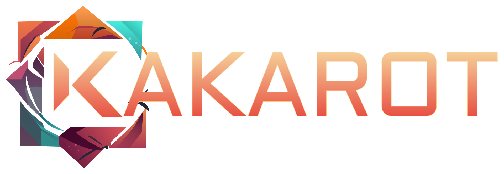
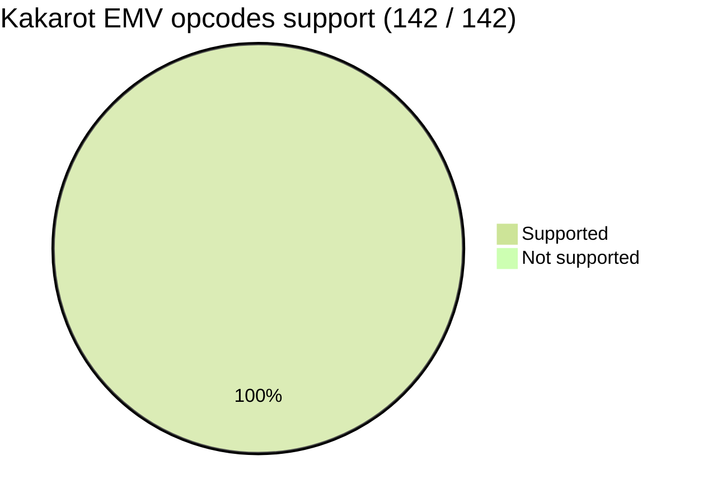
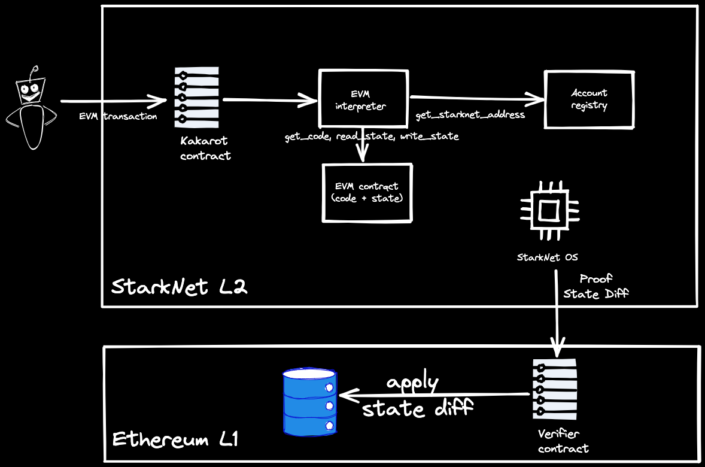
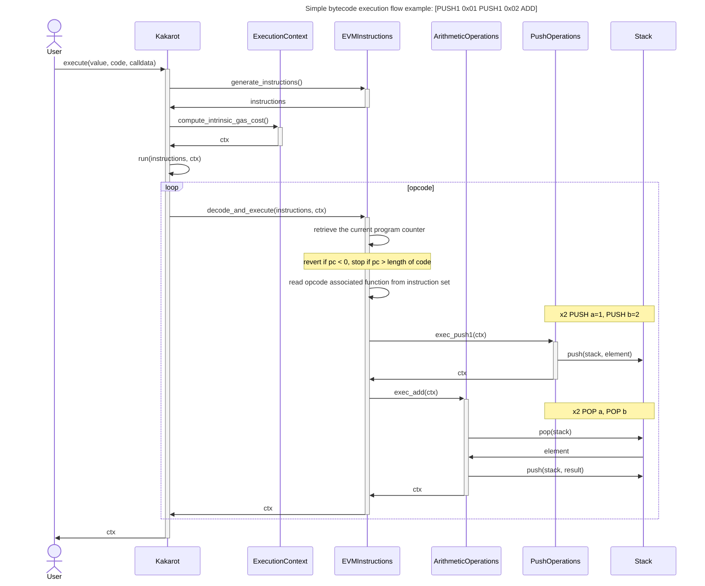

<p align="center">
    
</p>
<div align="center">
  <h3 align="center">
  EVM interpreter written in Cairo, a sort of ZK-EVM emulator, leveraging STARK
  proof system.
  </h3>
</div>


[](https://t.me/KakarotZkEvm)

[](https://www.newton.so/view?tags=kakarot)

[](https://twitter.com/KakarotZkEvm)

<div align="center">

**Kakarot** is an Ethereum Virtual Machine written in Cairo. It means it can be
deployed on StarkNet, a layer 2 scaling solution for Ethereum, and run any EVM
bytecode program. Hence, Kakarot can be used to run Ethereum smart contracts on
StarkNet. Kakarot is the super sayajin zkEVM! Why? Because:
`It's over 9000!!!!!`.

It is a work in progress, and it is not ready for production.

[Latest presentation of Kakarot at Starkware Session TLV 2023](https://www.youtube.com/watch?v=HnIqnhWdxpA)

[Getting started](#getting-started) • [Supported opcodes](#supported-opcodes) •
[Build](#build) • [Test](#test) •
[Report a bug](https://github.com/sayajin-labs/kakarot/issues/new?assignees=&labels=bug&template=01_BUG_REPORT.md&title=bug%3A+)
• [Questions](https://www.newton.so/view?tags=kakarot)

</div>


## Supported opcodes



Here is the list of supported opcodes: [opcodes](docs/supported_opcodes.md)

## Documentation

### Architecture



- ✅ Kakarot is a smart contract, deployed on Starknet (goerli). It is written
  in Cairo.

- ✅ Kakarot can: (a) execute arbitrary EVM bytecode, (b) deploy an EVM smart
  contract as is, (c) call a Kakarot-deployed EVM smart contract's functions
  (views and write methods).

- ✅ Kakarot is an EVM bytecode interpreter.

- ❌ Kakarot is not a blockchain.

- ❌ Kakarot is not a compiler. Check out
  [Warp](https://github.com/NethermindEth/warp) for a Solidity -> Cairo
  transpiler

### Main execution flow



### Execution sample

Execution of a simple EVM bytecode program on Kakarot.

The bytecode is the following:

```console
6001600503600301610166016002026105b40460020500
```

Which corresponds to the following EVM program:

```console
0x60 - PUSH1
0x60 - PUSH1
0x03 - SUB
0x60 - PUSH1
0x01 - ADD
0x61 - PUSH2
0x01 - ADD
0x60 - PUSH1
0x02 - MUL
0x61 - PUSH2
0x04 - DIV
0x60 - PUSH1
0x05 - SDIV
0x00 - STOP
```

Here is the execution trace of the program on Kakarot:


## Getting started

To contribute, please check out
[the contribution guide](./docs/CONTRIBUTING.md).

```bash
# install poetry if you don't have it already
# curl -sSL https://install.python-poetry.org | python3 -
make setup
```

## Build

To build the Cairo files:

```bash
make build
```

To build the test Solidity smart contracts:

```bash
# install foundry if you don't have it already
# curl -L https://foundry.paradigm.xyz | bash
# foundryup
make build-sol
```

## Test

```bash
# Run all tests
make test

# Run only unit tests
make test-units

# Run only integration tests
make test-integration

# Run a specific test file
pytest <PATH_TO_FILE>  # with pytest
python3 -m unittest <PATH_TO_FILE>  # with unittest

# Run a specific test mark (markers in pyproject.toml)
make run-test-mark mark=<MARK>
make run-test-mark-log mark=<MARK> # with log
```

Test architecture is the following:

- tests/unit/src contains cairo tests for each cairo function in the kakarot
  codebase
- tests/integration/bytecode contains python tests for kakarot execute()
  function with forged bytecode
- tests/integration/solidity_contracts contains python tests for solidity
  contracts that are compiled, deployed on kakarot local node and interacted
  with kakarot execute_at_address()
- the project also contains some forge tests (e.g. `PlainOpcodes.t.sol`) whose
  purpose is to test easily the solidity functions meant to be tested with
  kakarot, i.e. quickly making sure that they return the expected output so that
  we know that we focus on kakarot testing and not .sol testing. They are not
  part of the CI. Simply use `forge test` to run them.

## Deploy

The following describes how to deploy the entire Kakarot **EVM** on StarkNet.

It is **not** a description on how to deploy a contract on the official Kakarot
zkEVM.

The Kakarot EVM can be deployed on StarkNet using a python script utilizing the
[starknet.py](https://starknetpy.readthedocs.io/en/latest/) library.

First we need to declare some environment variables that are required for the
deployment.

Start by copying the `.env_example` file located in the root directory (`.files`
are usually hidden by default in most explorers. You should be able to see the
file in your IDE).

Rename the copied file to `.env`.

The file holds the following content:

```text
PRIVATE_KEY=your_private_key
ACCOUNT_ADDRESS=your_account_address
```

Now replace the placeholder values with your account and network details.

`PRIVATE_KEY` is the private key of the account contract that will pay for the
deployment. **This should be a decimal number**

`ACCOUNT_ADDRESS` is the address of the account contract that will pay for the
deployment (not the public key). **This should be a hexadecimal number**

Here is a concrete example:

```text
PRIVATE_KEY=72893439023848923y4138741073892473874203487234872208352937239047293428374088
ACCOUNT_ADDRESS=0x06e5d623aBe979c3DEFf52bE6DF5116352C12Ee21428D5b2CF91cA440c4edBD0
```

By default, everything will run on a local starknet-devnet (started with
`make run`). If you want to deploy to a given target, set the `STARKNET_NETWORK`
env variable, for example:

```bash
make deploy # localhost
STARKNET_NETWORK=testnet make deploy
STARKNET_NETWORK=testnet2 make deploy
STARKNET_NETWORK=mainnet make deploy
```

Deployed contract addresses will be stored in
`./deployments/{networks}/deployments.json`.

A step by step description of the individual components and how they are
deployed/configured can be found [here](docs/general/kakarot_components.md).

## License

**kakarot** is released under the [MIT](LICENSE).

## Security

Kakarot follows good practices of security, but 100% security cannot be assured.
Kakarot is provided **"as is"** without any **warranty**. Use at your own risk.

_For more information and to report security issues, please refer to our
[security documentation](docs/SECURITY.md)._

## Callgraphs

The callgraph artifacts contains all the contract's call graph. Those are
generated using [thoth](https://github.com/FuzzingLabs/thoth) and can provide
some more insight on the inside of this zkEVM. The legend can be found
[here](https://github.com/FuzzingLabs/thoth/blob/master/images/callgraph_legend.png).
You can use [this tool](https://dreampuf.github.io/GraphvizOnline/) to visualize
the .gv files online.

## Questions / FAQ

Questions are welcome! If you have any questions regarding Kakarot, feel free to
ask them using [Newton](https://www.newton.so/view?tags=kakarot).

### FAQ

- [What is Kakarot, the zkEVM written in Cairo?](https://www.newton.so/view/6384d1e75bfa675b854c3228)
- [Is Kakarot zkEVM a blockchain?](https://www.newton.so/view/6384d22a5bfa675b854c3229)
- [When will Kakarot zkEVM launch on mainnet?](https://www.newton.so/view/6384d25fac8f7c40f4f144fd)
- [Does Kakarot zkEVM have a token?](https://www.newton.so/view/6384d2815bfa675b854c322a)
- [Is Kakarot zkEVM a smart contract or a blockchain?](https://www.newton.so/view/6384d2a0ac8f7c40f4f144fe)
- [Is Kakarot a Starkware project?](https://www.newton.so/view/6384d2be5bfa675b854c322b)
- [Is Kakarot part of the Starknet ecosystem?](https://www.newton.so/view#:~:text=Is%20Kakarot%20part%20of%20the%20Starknet%20ecosystem%3F)
- [Will Kakarot be an L3 on top of the Starknet validity rollup?](https://www.newton.so/view/6384d3235bfa675b854c322c)
- [Can I add Kakarot to my metamask?](https://www.newton.so/view/6384d38fac8f7c40f4f14500)
- [Is Kakarot equivalent to Arbitrum?](https://www.newton.so/view/6384d3d85bfa675b854c322d)

## Contributing

First off, thanks for taking the time to contribute! Contributions are what make
the open-source community such an amazing place to learn, inspire, and create.
Any contributions you make will benefit everybody else and are **greatly
appreciated**.

Please read [our contribution guidelines](docs/CONTRIBUTING.md), and thank you
for being involved!

## Contributors

<!-- ALL-CONTRIBUTORS-LIST:START - Do not remove or modify this section -->
<!-- prettier-ignore-start -->
<!-- markdownlint-disable -->
<table>
  <tbody>
    <tr>
      <td align="center" valign="top" width="14.28%"><a href="https://github.com/abdelhamidbakhta"><br /><sub><b>Abdel @ StarkWare </b></sub></a><br /><a href="https://github.com/sayajin-labs/kakarot/commits?author=abdelhamidbakhta" title="Code">💻</a> <a href="https://github.com/sayajin-labs/kakarot/commits?author=abdelhamidbakhta" title="Tests">⚠️</a> <a href="https://github.com/sayajin-labs/kakarot/commits?author=abdelhamidbakhta" title="Documentation">📖</a> <a href="#infra-abdelhamidbakhta" title="Infrastructure (Hosting, Build-Tools, etc)">🚇</a> <a href="#projectManagement-abdelhamidbakhta" title="Project Management">📆</a> <a href="#mentoring-abdelhamidbakhta" title="Mentoring">🧑‍🏫</a></td>
      <td align="center" valign="top" width="14.28%"><a href="https://github.com/LucasLvy"><br /><sub><b>Lucas</b></sub></a><br /><a href="https://github.com/sayajin-labs/kakarot/commits?author=LucasLvy" title="Code">💻</a> <a href="https://github.com/sayajin-labs/kakarot/commits?author=LucasLvy" title="Tests">⚠️</a> <a href="https://github.com/sayajin-labs/kakarot/commits?author=LucasLvy" title="Documentation">📖</a> <a href="#mentoring-LucasLvy" title="Mentoring">🧑‍🏫</a></td>
      <td align="center" valign="top" width="14.28%"><a href="https://github.com/0xMentorNotAPseudo"><br /><sub><b>Mentor Reka</b></sub></a><br /><a href="https://github.com/sayajin-labs/kakarot/commits?author=0xMentorNotAPseudo" title="Code">💻</a> <a href="https://github.com/sayajin-labs/kakarot/commits?author=0xMentorNotAPseudo" title="Tests">⚠️</a> <a href="https://github.com/sayajin-labs/kakarot/commits?author=0xMentorNotAPseudo" title="Documentation">📖</a> <a href="#infra-0xMentorNotAPseudo" title="Infrastructure (Hosting, Build-Tools, etc)">🚇</a></td>
      <td align="center" valign="top" width="14.28%"><a href="https://github.com/danilowhk"><br /><sub><b>danilowhk</b></sub></a><br /><a href="https://github.com/sayajin-labs/kakarot/commits?author=danilowhk" title="Code">💻</a> <a href="https://github.com/sayajin-labs/kakarot/commits?author=danilowhk" title="Tests">⚠️</a></td>
      <td align="center" valign="top" width="14.28%"><a href="https://linktr.ee/lenny.codes"><br /><sub><b>Lenny</b></sub></a><br /><a href="https://github.com/sayajin-labs/kakarot/commits?author=0xlny" title="Code">💻</a> <a href="https://github.com/sayajin-labs/kakarot/commits?author=0xlny" title="Tests">⚠️</a></td>
      <td align="center" valign="top" width="14.28%"><a href="https://github.com/florian-bellotti"><br /><sub><b>Florian Bellotti</b></sub></a><br /><a href="https://github.com/sayajin-labs/kakarot/commits?author=florian-bellotti" title="Code">💻</a> <a href="https://github.com/sayajin-labs/kakarot/commits?author=florian-bellotti" title="Tests">⚠️</a></td>
      <td align="center" valign="top" width="14.28%"><a href="https://github.com/l-henri"><br /><sub><b>Henri</b></sub></a><br /><a href="https://github.com/sayajin-labs/kakarot/commits?author=l-henri" title="Code">💻</a> <a href="https://github.com/sayajin-labs/kakarot/commits?author=l-henri" title="Tests">⚠️</a></td>
    </tr>
    <tr>
      <td align="center" valign="top" width="14.28%"><a href="https://github.com/TotalPizza"><br /><sub><b>FreshPizza</b></sub></a><br /><a href="https://github.com/sayajin-labs/kakarot/commits?author=TotalPizza" title="Code">💻</a> <a href="https://github.com/sayajin-labs/kakarot/commits?author=TotalPizza" title="Tests">⚠️</a></td>
      <td align="center" valign="top" width="14.28%"><a href="https://www.linkedin.com/in/clementwalter"><br /><sub><b>Clément Walter</b></sub></a><br /><a href="https://github.com/sayajin-labs/kakarot/commits?author=ClementWalter" title="Documentation">📖</a> <a href="https://github.com/sayajin-labs/kakarot/commits?author=ClementWalter" title="Tests">⚠️</a> <a href="https://github.com/sayajin-labs/kakarot/commits?author=ClementWalter" title="Code">💻</a></td>
      <td align="center" valign="top" width="14.28%"><a href="https://github.com/richwarner"><br /><sub><b>Rich Warner</b></sub></a><br /><a href="https://github.com/sayajin-labs/kakarot/commits?author=richwarner" title="Code">💻</a> <a href="https://github.com/sayajin-labs/kakarot/commits?author=richwarner" title="Tests">⚠️</a></td>
      <td align="center" valign="top" width="14.28%"><a href="https://github.com/pscott"><br /><sub><b>pscott</b></sub></a><br /><a href="https://github.com/sayajin-labs/kakarot/commits?author=pscott" title="Code">💻</a> <a href="https://github.com/sayajin-labs/kakarot/commits?author=pscott" title="Tests">⚠️</a></td>
      <td align="center" valign="top" width="14.28%"><a href="https://github.com/Eikix"><br /><sub><b>Elias Tazartes</b></sub></a><br /><a href="https://github.com/sayajin-labs/kakarot/commits?author=Eikix" title="Code">💻</a> <a href="https://github.com/sayajin-labs/kakarot/commits?author=Eikix" title="Tests">⚠️</a></td>
      <td align="center" valign="top" width="14.28%"><a href="https://github.com/Riad15l"><br /><sub><b>Riad15l</b></sub></a><br /><a href="https://github.com/sayajin-labs/kakarot/commits?author=Riad15l" title="Code">💻</a> <a href="https://github.com/sayajin-labs/kakarot/commits?author=Riad15l" title="Tests">⚠️</a></td>
      <td align="center" valign="top" width="14.28%"><a href="https://github.com/tyler-smith"><br /><sub><b>Tyler Smith</b></sub></a><br /><a href="https://github.com/sayajin-labs/kakarot/commits?author=tyler-smith" title="Tests">⚠️</a></td>
    </tr>
    <tr>
      <td align="center" valign="top" width="14.28%"><a href="https://github.com/spapinistarkware"><br /><sub><b>Shahar Papini</b></sub></a><br /><a href="#mentoring-spapinistarkware" title="Mentoring">🧑‍🏫</a> <a href="https://github.com/sayajin-labs/kakarot/commits?author=spapinistarkware" title="Code">💻</a> <a href="https://github.com/sayajin-labs/kakarot/commits?author=spapinistarkware" title="Tests">⚠️</a></td>
      <td align="center" valign="top" width="14.28%"><a href="https://github.com/Riad-Quadratic"><br /><sub><b>Riad &#124; Quadratic</b></sub></a><br /><a href="https://github.com/sayajin-labs/kakarot/commits?author=Riad-Quadratic" title="Code">💻</a></td>
      <td align="center" valign="top" width="14.28%"><a href="https://github.com/thomas-quadratic"><br /><sub><b>thomas-quadratic</b></sub></a><br /><a href="https://github.com/sayajin-labs/kakarot/commits?author=thomas-quadratic" title="Code">💻</a></td>
      <td align="center" valign="top" width="14.28%"><a href="https://www.linkedin.com/in/pedro-bergamini-611496160/"><br /><sub><b>Pedro Bergamini</b></sub></a><br /><a href="https://github.com/sayajin-labs/kakarot/commits?author=pedrobergamini" title="Code">💻</a></td>
      <td align="center" valign="top" width="14.28%"><a href="https://github.com/ptisserand"><br /><sub><b>ptisserand</b></sub></a><br /><a href="https://github.com/sayajin-labs/kakarot/commits?author=ptisserand" title="Code">💻</a></td>
      <td align="center" valign="top" width="14.28%"><a href="https://github.com/hurrikaanig"><br /><sub><b>TurcFort07</b></sub></a><br /><a href="https://github.com/sayajin-labs/kakarot/commits?author=hurrikaanig" title="Code">💻</a></td>
      <td align="center" valign="top" width="14.28%"><a href="https://www.linkedin.com/in/mnemba-chambuya"><br /><sub><b>Mnemba Chambuya</b></sub></a><br /><a href="https://github.com/sayajin-labs/kakarot/commits?author=mnekx" title="Code">💻</a></td>
    </tr>
    <tr>
      <td align="center" valign="top" width="14.28%"><a href="https://github.com/matthieuauger"><br /><sub><b>Matthieu Auger</b></sub></a><br /><a href="#mentoring-matthieuauger" title="Mentoring">🧑‍🏫</a> <a href="https://github.com/sayajin-labs/kakarot/commits?author=matthieuauger" title="Tests">⚠️</a> <a href="https://github.com/sayajin-labs/kakarot/commits?author=matthieuauger" title="Code">💻</a></td>
      <td align="center" valign="top" width="14.28%"><a href="https://github.com/ftupas"><br /><sub><b>ftupas</b></sub></a><br /><a href="https://github.com/sayajin-labs/kakarot/commits?author=ftupas" title="Code">💻</a></td>
      <td align="center" valign="top" width="14.28%"><a href="https://github.com/jobez"><br /><sub><b>johann bestowrous</b></sub></a><br /><a href="https://github.com/sayajin-labs/kakarot/commits?author=jobez" title="Code">💻</a></td>
      <td align="center" valign="top" width="14.28%"><a href="https://seshanth.xyz/"><br /><sub><b>Seshanth.S</b></sub></a><br /><a href="https://github.com/sayajin-labs/kakarot/commits?author=seshanthS" title="Code">💻</a></td>
      <td align="center" valign="top" width="14.28%"><a href="https://bezier.fi/"><br /><sub><b>Flydexo</b></sub></a><br /><a href="https://github.com/sayajin-labs/kakarot/commits?author=Flydexo" title="Code">💻</a> <a href="https://github.com/sayajin-labs/kakarot/commits?author=Flydexo" title="Tests">⚠️</a> <a href="https://github.com/sayajin-labs/kakarot/commits?author=Flydexo" title="Documentation">📖</a></td>
      <td align="center" valign="top" width="14.28%"><a href="https://github.com/petarcalic99"><br /><sub><b>Petar Calic</b></sub></a><br /><a href="https://github.com/sayajin-labs/kakarot/commits?author=petarcalic99" title="Code">💻</a> <a href="https://github.com/sayajin-labs/kakarot/commits?author=petarcalic99" title="Tests">⚠️</a></td>
      <td align="center" valign="top" width="14.28%"><a href="https://github.com/gaetbout"><br /><sub><b>gaetbout</b></sub></a><br /><a href="#infra-gaetbout" title="Infrastructure (Hosting, Build-Tools, etc)">🚇</a></td>
    </tr>
    <tr>
      <td align="center" valign="top" width="14.28%"><a href="https://github.com/greged93"><br /><sub><b>greged93</b></sub></a><br /><a href="https://github.com/sayajin-labs/kakarot/commits?author=greged93" title="Code">💻</a> <a href="https://github.com/sayajin-labs/kakarot/commits?author=greged93" title="Tests">⚠️</a></td>
      <td align="center" valign="top" width="14.28%"><a href="https://github.com/FranFiuba"><br /><sub><b>Francisco Strambini</b></sub></a><br /><a href="https://github.com/sayajin-labs/kakarot/commits?author=FranFiuba" title="Code">💻</a> <a href="https://github.com/sayajin-labs/kakarot/commits?author=FranFiuba" title="Tests">⚠️</a></td>
      <td align="center" valign="top" width="14.28%"><a href="https://github.com/mradolux"><br /><sub><b>mradolux</b></sub></a><br /><a href="https://github.com/sayajin-labs/kakarot/commits?author=mradolux" title="Code">💻</a> <a href="https://github.com/sayajin-labs/kakarot/commits?author=mradolux" title="Tests">⚠️</a></td>
      <td align="center" valign="top" width="14.28%"><a href="https://github.com/omahs"><br /><sub><b>omahs</b></sub></a><br /><a href="https://github.com/sayajin-labs/kakarot/commits?author=omahs" title="Documentation">📖</a></td>
      <td align="center" valign="top" width="14.28%"><a href="https://github.com/ArnaudBD"><br /><sub><b>ArnaudBD</b></sub></a><br /><a href="https://github.com/sayajin-labs/kakarot/commits?author=ArnaudBD" title="Documentation">📖</a></td>
    </tr>
  </tbody>
</table>

<!-- markdownlint-restore -->
<!-- prettier-ignore-end -->

<!-- ALL-CONTRIBUTORS-LIST:END -->

<p align="center">
    
</p>
