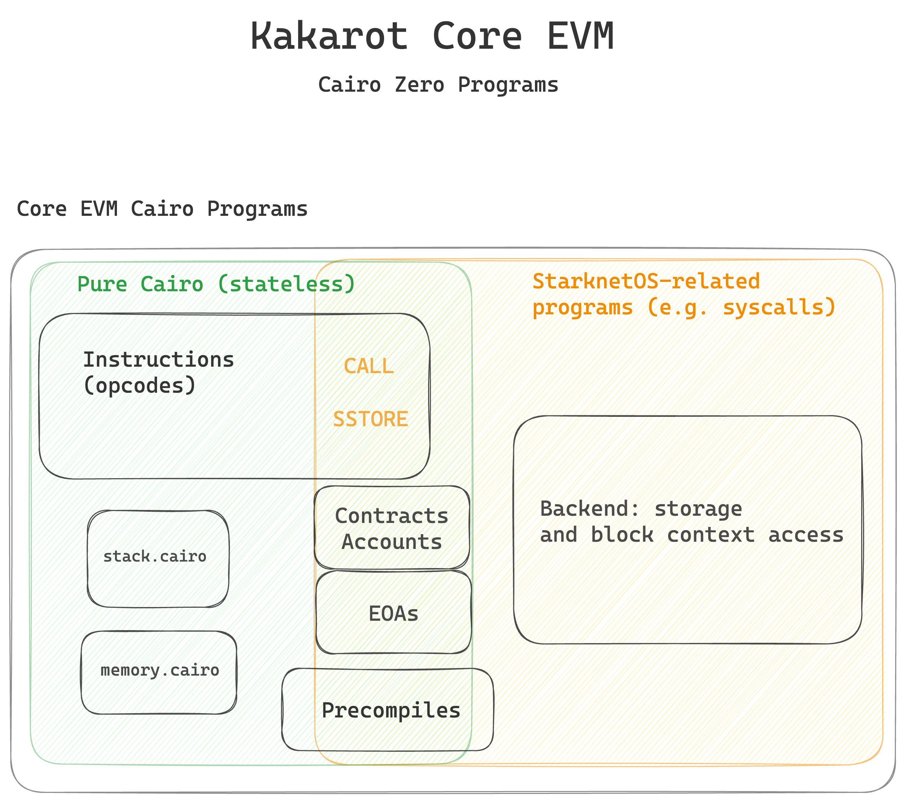
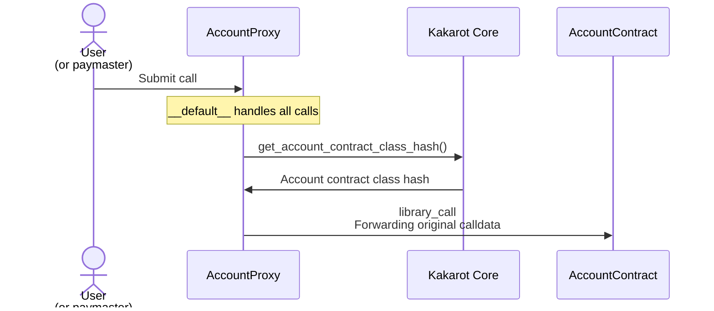
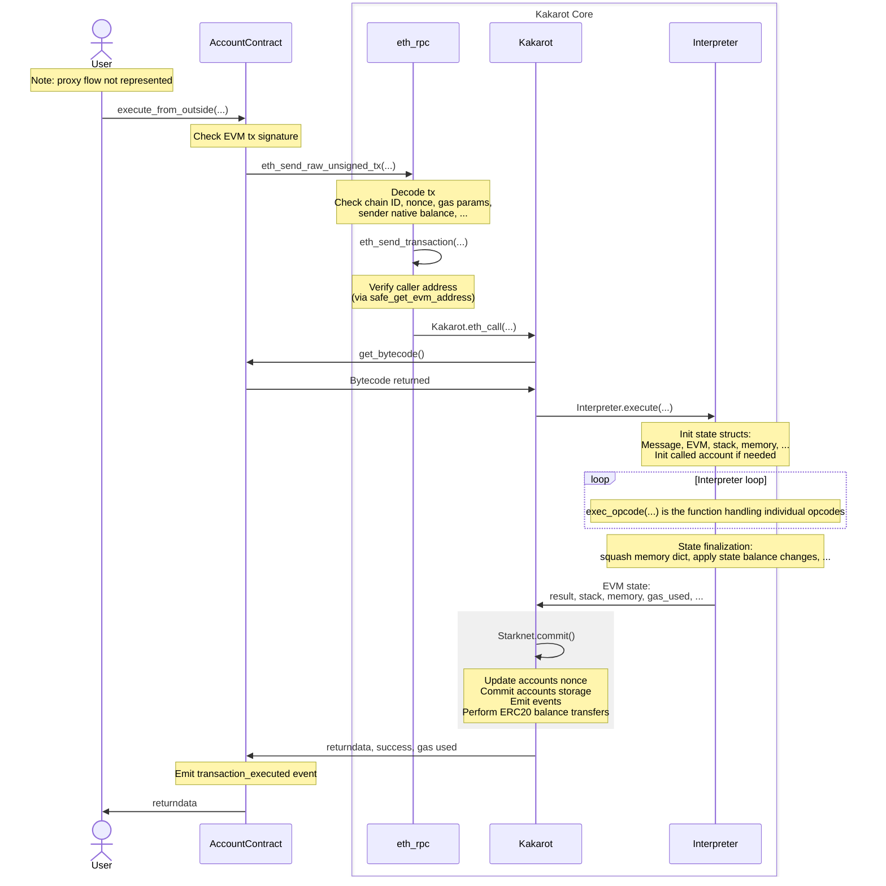

<p align="center">
    
</p>
<div align="center">
  <h3 align="center">
  Kakarot, the zkEVM written in Cairo.
  </h3>
</div>

[](https://github.com/kkrt-labs/kakarot/actions)
[](https://github.com/kkrt-labs/kakarot/blob/main/LICENSE)
[](https://github.com/kkrt-labs/kakarot/graphs/contributors)

[](https://t.me/KakarotZkEvm)
[](https://github.com/kkrt-labs/kakarot/blob/main/docs/CONTRIBUTING.md)
[](https://github.com/kkrt-labs/kakarot/stargazers)
[](https://x.com/KakarotZkEvm)
[](https://discord.gg/kakarotzkevm)

This repository contains the set of Cairo (Cairo compiler version Zero) programs
that implement the core EVM logic of Kakarot zkEVM.

Kakarot is an EVM implementation in Cairo. Cairo being a high-level
zero-knowledge domain specific language (zkDSL), Kakarot is provable by design.
This allows for proving the execution of EVM transactions, and makes Kakarot a
_de facto_ so-called _zkEVM_.

We strongly believe the CairoVM will provide the best zero-knowledge toolbox in
the coming years and that the Ethereum network effect will remain prevalent. We
present to developers an abstraction layer they're familiar with: the EVM. Build
and deploy as if you were working on Ethereum, be forward compatible with the
future of zero-knowledge.

[Kakarot presentations and talks around the world](https://www.youtube.com/playlist?list=PLF3T1714MyKDwjjA8oHizXAdLNx62ka5U)

[Getting started](#getting-started) • [Build](#build) • [Test](#test) •
[Report a bug](https://github.com/kkrt-labs/kakarot/issues/new?assignees=&labels=bug&template=01_BUG_REPORT.md&title=bug%3A+)

## Supported opcodes

We support 100% of EVM opcodes and
[9 out of 10 precompiles](https://docs.kakarot.org/starknet/architecture/cairo-precompiles).

## Documentation

### Architecture

Here is a high-level architecture diagram of the entire Kakarot zkEVM system.

<p align="center">
  
</p>

The set of Cairo programs in this repository are represented below:

<p align="center">
  
</p>

- ✅ Kakarot Core EVM is a set of Cairo programs

- ✅ Kakarot can be packaged as a smart contract and deployed on any chain that
  runs the CairoVM (StarknetOS chains, Starknet Appchains, Starknet clients).

- ✅ Kakarot is an EVM implementation.

- ⚠️ Kakarot Core EVM (the Cairo programs in this repository) is not a
  blockchain by itself. Combined with an underlying CairoVM chain, an RPC layer,
  it forms an EVM runtime embedded inside a Starknet appchain.

- ❌ Kakarot is not a compiler.

## Getting started

To contribute and setup your development environment, please check out
[the contribution guide](./docs/CONTRIBUTING.md).

## Build

The project uses [uv](https://github.com/astral-sh/uv) to manage python
dependencies and run commands. To install uv:

```bash
curl -LsSf https://astral.sh/uv/install.sh | sh
```

To setup the project and install
[all dependencies](docs/CONTRIBUTING.md#prerequisites):

```bash
make setup
```

To build the CairoZero files:

```bash
make build
```

To build the test Solidity smart contracts:

```bash
# install foundry if you don't have it already
# curl -L https://foundry.paradigm.xyz | bash
# foundryup
make build-sol
```

## Code style

The project uses [trunk.io](https://trunk.io/) to run a comprehensive list of
linters.

To install Trunk, run:

```bash
curl https://get.trunk.io -fsSL | bash
```

You can also add Trunk to VSCode with
[this extension](https://marketplace.visualstudio.com/items?itemName=Trunk.io).

Then, don't forget to select Trunk as your default formatter in VSCode (command
palette > Format Document With > Trunk).

Once Trunk is installed, you can install a pre-push hook to run the linters
before each push:

```bash
trunk git-hooks sync
```

## Test

### Kakarot tests

Kakarot tests uses [pytest](https://docs.pytest.org/) as test runner. Make sure
to read the [doc](https://docs.pytest.org/) and get familiar with the tool to
benefit from all of its features.

```bash
# Runs a local CairoVM client (or StarknetOS chain)
make run-nodes

# Run all tests. This requires a Katana instance and an Anvil instance running in the background: `make run-nodes`
make test

# Run only unit tests
make test-unit

# Run only e2e tests
make test-end-to-end

# Run a specific test file
pytest <PATH_TO_FILE>

# Run a specific test mark (markers in pyproject.toml)
pytest -m <MARK>
```

Test architecture is the following:

- tests/src contains cairo tests for each cairo function in the kakarot codebase
  running either in plain cairo or with the starknet test runner;
- tests/end_to_end contains end-to-end tests running on an underlying
  Starknet-like network (using the Starknet RPC), currently
  [Katana](https://github.com/dojoengine/dojo). These end-to-end tests contain
  both raw bytecode execution tests and test on real solidity contracts.

The difference between the starknet test runner (when using contracts) and the
plain cairo one is that the former emulate a whole starknet network and is as
such much slower (~10x).

Consequently, when writing tests, don't use contracts unless it's really
required. Actually, for tests requiring a Starknet devnet, prefer end-to-end
relying only on a RPC endpoint and currently running on Katana.

For an example of the cairo test runner, see for example
[the RLP library tests](./cairo_zero/tests/src/utils/test_rlp.py). Especially,
the cairo runner uses hints to communicate values and return outputs:

- `kwargs` of `cairo_run` are available in the `program_input` variable
- values written in the `output_ptr` segment are returned, e.g.
  `segments.write_arg(output_ptr, [ids.x])` will return the list `[x]`.

Both cairo and starknet tests can be used with the `--profile-cairo` flag to
generate a profiling file (see the `--profile_output` flag of the `cairo-run`
CLI). The file can then be used with `pprof`, for example:

```bash
go tool pprof --png <path_to_file.pb.gz>
```

The project also contains a regular forge project (`./solidity_contracts`) to
generate real artifacts to be tested against. This project also contains some
forge tests (e.g. `PlainOpcodes.t.sol`) which purpose is to test easily the
solidity functions meant to be tested with kakarot, i.e. quickly making sure
that they return the expected output so that we know that we focus on kakarot
testing and not .sol testing. They are not part of the CI. Simply use
`forge test` to run them.

### EF tests

To run the [Ethereum Foundation test suite](https://github.com/ethereum/tests),
you need to pull locally
[the Kakarot ef-tests runner](https://github.com/kkrt-labs/ef-tests). To
simplify the devX, you can create symlinks in the ef-tests repo pointing to your
local changes. For example:

```bash
ln -s /Users/clementwalter/Documents/kkrt-labs/kakarot/blockchain-tests-skip.yml blockchain-tests-skip.yml
mkdir build && cd build
ln -s /Users/clementwalter/Documents/kkrt-labs/kakarot/build/ v0
ln -s /Users/clementwalter/Documents/kkrt-labs/kakarot/build/fixtures/ common
```

With this setting, you can run a given EF test against your local Kakarot build
by running (in the ef test directory):

```bash
cargo test <test_name> --features v0 -- --nocapture
# e.g. cargo test test_sha3_d7g0v0_Cancun --features v0 -- --nocapture
```

See [this doc](./docs/general/decode_a_cairo_trace.md) to learn how to debug a
cairo trace when the CairoVM reverts.

## Deploy

The following describes how to deploy the Kakarot as a Starknet smart contract
on an underlying StarknetOS network.

It is **not** a description on how to deploy a solidity contract on the Kakarot
EVM.

Note that the chosen `chain_id` when deploying is important:

- To keep compatibility with metamask the max chain id is 4503599627370476 see
  https://gist.github.com/rekmarks/a47bd5f2525936c4b8eee31a16345553
- To be compatible with ledger the chain id needs to be inferior to 4 bytes see
  https://github.com/kkrt-labs/kakarot/issues/1530

The [deploy script](./kakarot_scripts/deployment/kakarot_deployment.py) relies
on some env variables defined in a `.env` file located at the root of the
project and loaded in the [constant file](./kakarot_scripts/constants.py). To
get started, just

```bash
cp .env.example .env
```

The default file is self sufficient for using Kakarot with KATANA. If targeting
other networks, make sure to fill the corresponding variables.

Furthermore, if you want to run the
[check-resources](./kakarot_scripts/check_resources.py) locally to check the
steps usage of your local changes in the EF tests against main and other
branches, you need to fill the following

```text
GITHUB_TOKEN=your_github_token
```

You can learn how to create this token from
[here](https://docs.github.com/en/authentication/keeping-your-account-and-data-secure/creating-a-personal-access-token),
we would suggest using a fine-grained token with only read access.

By default, everything will run on a local katana (started with
`make run-katana`). If you want to deploy to a given target, set the
`STARKNET_NETWORK` env variable, for example:

```bash
make deploy # localhost
STARKNET_NETWORK=testnet make deploy
STARKNET_NETWORK=mainnet make deploy
```

Deployed contract addresses will be stored in
`./deployments/{networks}/deployments.json`.

A step by step description of the individual components and how they are
deployed/configured can be found [here](docs/general/kakarot_components.md).

## Slither

To run slither against provided Kakarot solidity contracts, you need to install
slither and run:

```bash
forge build --build-info --force
slither . --foundry-out-directory solidity_contracts/build --ignore-compile --include-paths "DualVmToken.sol|L1KakarotMessaging.sol|L2KakarotMessaging.sol" --checklist > report.md
```

## Deeper dive

This deep dive was written by Zellic
([Filippo Cremonese](https://github.com/fcremo)) as a result of their audit of
Kakarot, as well as their preparation for the Code4rena competitive audit of the
codebase. A more in-depth note can be found on
[Code4rena](https://code4rena.com/audits/2024-09-kakarot).

Kakarot consists of two major logical components: the core contract and the
account contract.

### Core contract

The core contract handles transaction parsing and implements the interpreter
which executes EVM bytecode. Only one instance of this contract is deployed.

### Account contract

As the name suggests, the account contract represents EVM accounts, both smart
contracts and externally owner accounts (EOAs). Each EVM account is represented
by a separate instance of the account contract (or more accurately, by an
instance of a proxy contract, see the following section) which stores the state
of the account, including the nonce, bytecode, and persistent storage. The
account balance is not stored in the account contract, since Kakarot uses a
Starknet ERC20 token as its EVM-native currency.

Note that while executing a transaction, information about the state of an
account is usually read from the account contract and cached directly by the
core contract. The account state is updated by the core contract only when
required -- typically when a transaction has finished processing and changes to
the account state need to be committed.

### Account contract deployment

[^NOTE: some aspects of contract deployment changed since the code revision
audited by Zellic. This description tries to match the current behavior]

One of the Kakarot design goals is to guarantee a deterministic Starknet address
for each Kakarot account contract not influenced by the implementation of the
account contract. This allows to upgrade the account contract implementation
without affecting the Starknet address of a Kakarot EVM account, and to derive
the Starknet address of an account contract before it is even deployed and/or
off-chain.

It also allows the core contract to authenticate the source of a call and
determine whether it originates from a legitimate Kakarot account contract.

To achieve this, Kakarot deploys an instance of a simple account proxy contract
to represent each EVM account. When called, the proxy contract obtains the class
hash of the actual account contract from the Kakarot core contract and performs
a library call (essentially the equivalent of EVM `delegatecall` for Cairo).

The account proxy is always deployed by the core Kakarot contract, setting
`deploy_from_zero=FALSE`. The constructor also receives the EVM address
represented by the account contract. Therefore,
[the Starknet address of an account (proxy) contract](https://github.com/kkrt-labs/kakarot/blob/221b97671ad7cf21d01ee52ffd48f2b7c018ffc5/src/kakarot/account.cairo#L519)
depends on the following variables:

- the class hash of the proxy contract
- the address of the Kakarot core contract
- the EVM address represented by the account contract

### Transaction flow

Note: important details of the transaction flow changed since the code revision
reviewed by Zellic. This includes changes to the account contract entrypoints
and the separation of concerns between the core contract and account contract.

The flow of an EVM transaction into Kakarot is deep and could feel overwhelming
at first. This section illustrates the execution path of a normal Ethereum
transaction. Some simplifications and omissions needed to be made, but it should
give you a good idea of the steps that are taken from the very entry point,
right down to the EVM interpreter loop.

The journey starts with the account contract representing the EVM account
sending the transaction; to be specific, the first entry point into Kakarot is
the
[`__default__`](https://github.com/kkrt-labs/kakarot/blob/2b57e602b4380554d09792ff182d9bdc2ad7a619/src/kakarot/accounts/uninitialized_account.cairo#L53)
function of the proxy account contract. The proxy retrieves from the core
Kakarot contract the class hash of the actual account contract implementation,
and library calls if (Starknet equivalent of `delegatecall`ing) forwarding the
original calldata. This allows to upgrade the implementation of all account
contracts at once. The diagram below shows this flow:



In the case of the Kakarot Starknet deployment, the Starknet transaction
typically be initiated by a paymaster account, which will fund the Starknet gas
required to process the transaction. Note however that anyone can call the
account proxy contract to submit an EVM transaction to Kakarot.

The entry point into the account contract is its
[`execute_from_outside`](https://github.com/kkrt-labs/kakarot/blob/2b57e602b4380554d09792ff182d9bdc2ad7a619/src/kakarot/accounts/account_contract.cairo#L96)
function. This function performs several checks, including verification of the
transaction signature, ensuring the transaction was signed by the private key
associated to the public key represented by the account.

After verifying the transaction signature, the account contract calls the
Kakarot core contract `eth_rpc` module, specifically the
[`eth_send_raw_unsigned_tx`](https://github.com/kkrt-labs/kakarot/blob/2b57e602b4380554d09792ff182d9bdc2ad7a619/src/kakarot/eth_rpc.cairo#L239)
function. This function verifies several other properties of the transaction
(nonce, chain ID, gas parameters, account balance), and invokes
[`eth_send_transaction`](https://github.com/kkrt-labs/kakarot/blob/2b57e602b4380554d09792ff182d9bdc2ad7a619/src/kakarot/eth_rpc.cairo#L188).

`eth_send_transaction` performs another critical check, verifying that the
Starknet address of the caller matches the expected Starknet address of the
sender of the EVM transaction. This guarantees that the caller is a legitimate
Kakarot account contract, and therefore that (modulo critical bugs) the
transaction signature was validated correctly.

Execution continues in the Kakarot core
[`eth_call`](https://github.com/kkrt-labs/kakarot/blob/2b57e602b4380554d09792ff182d9bdc2ad7a619/src/kakarot/library.cairo#L78)
function, which retrieves the bytecode of the contract being called from the
corresponding contract account.

Finally, execution reaches the actual virtual machine implementation. The
interpreter module
[`execute`](https://github.com/kkrt-labs/kakarot/blob/2b57e602b4380554d09792ff182d9bdc2ad7a619/src/kakarot/interpreter.cairo#L820)
function initializes all the structures needed to store the execution state
([`Message`](https://github.com/kkrt-labs/kakarot/blob/1b920421b354275e48d101a070d7aa3467eed9b6/src/kakarot/interpreter.cairo#L880),
[`Stack`](https://github.com/kkrt-labs/kakarot/blob/1b920421b354275e48d101a070d7aa3467eed9b6/src/kakarot/interpreter.cairo#L899),
[`Memory`](https://github.com/kkrt-labs/kakarot/blob/1b920421b354275e48d101a070d7aa3467eed9b6/src/kakarot/interpreter.cairo#L900),
[`State`](https://github.com/kkrt-labs/kakarot/blob/1b920421b354275e48d101a070d7aa3467eed9b6/src/kakarot/interpreter.cairo#L901),
[`EVM`](https://github.com/kkrt-labs/kakarot/blob/1b920421b354275e48d101a070d7aa3467eed9b6/src/kakarot/interpreter.cairo#L912)).

The interpreter loop is implemented using tail-recursion by the
[`run`](https://github.com/kkrt-labs/kakarot/blob/2b57e602b4380554d09792ff182d9bdc2ad7a619/src/kakarot/interpreter.cairo#L739)
function, and the individual opcodes are handled by the aptly-named
[`exec_opcode`](https://github.com/kkrt-labs/kakarot/blob/2b57e602b4380554d09792ff182d9bdc2ad7a619/src/kakarot/interpreter.cairo#L50).

When execution ends (successfully or not) the state of the accounts involved in
the transaction need to be updated. This is mostly handled by a call to
`Starknet.commit(...)`, which performs some finalization on the state structures
and then updates the state persisted in the account contracts (e.g. updating
their nonce or storage), and also performs the actual Starknet ERC20 transfers
needed to transfer the native currency used by Kakarot between accounts.

The following diagram summarizes the flow of a transaction from account contract
to the interpreter loop and back:



## License

**kakarot** is released under the [MIT](LICENSE).

## Security

Kakarot follows good practices of security, but 100% security cannot be assured.
Kakarot is provided **"as is"** without any **warranty**. Use at your own risk.

_For more information and to report security issues, please refer to our
[security documentation](docs/SECURITY.md)._

## Contributing

First off, thanks for taking the time to contribute! Contributions are what make
the open-source community such an amazing place to learn, inspire, and create.
Any contributions you make will benefit everybody else and are **greatly
appreciated**.

Please read [our contribution guidelines](docs/CONTRIBUTING.md), and thank you
for being involved!

## Contributors

<!-- ALL-CONTRIBUTORS-LIST:START - Do not remove or modify this section -->
<!-- prettier-ignore-start -->
<!-- markdownlint-disable -->
<table>
  <tbody>
    <tr>
      <td align="center" valign="top" width="14.28%"><a href="https://github.com/abdelhamidbakhta"><br /><sub><b>Abdel @ StarkWare </b></sub></a><br /><a href="https://github.com/kkrt-labs/kakarot/commits?author=abdelhamidbakhta" title="Code">💻</a> <a href="https://github.com/kkrt-labs/kakarot/commits?author=abdelhamidbakhta" title="Tests">⚠️</a> <a href="https://github.com/kkrt-labs/kakarot/commits?author=abdelhamidbakhta" title="Documentation">📖</a> <a href="#infra-abdelhamidbakhta" title="Infrastructure (Hosting, Build-Tools, etc)">🚇</a> <a href="#projectManagement-abdelhamidbakhta" title="Project Management">📆</a> <a href="#mentoring-abdelhamidbakhta" title="Mentoring">🧑‍🏫</a></td>
      <td align="center" valign="top" width="14.28%"><a href="https://github.com/LucasLvy"><br /><sub><b>Lucas</b></sub></a><br /><a href="https://github.com/kkrt-labs/kakarot/commits?author=LucasLvy" title="Code">💻</a> <a href="https://github.com/kkrt-labs/kakarot/commits?author=LucasLvy" title="Tests">⚠️</a> <a href="https://github.com/kkrt-labs/kakarot/commits?author=LucasLvy" title="Documentation">📖</a> <a href="#mentoring-LucasLvy" title="Mentoring">🧑‍🏫</a></td>
      <td align="center" valign="top" width="14.28%"><a href="https://github.com/0xMentorNotAPseudo"><br /><sub><b>Mentor Reka</b></sub></a><br /><a href="https://github.com/kkrt-labs/kakarot/commits?author=0xMentorNotAPseudo" title="Code">💻</a> <a href="https://github.com/kkrt-labs/kakarot/commits?author=0xMentorNotAPseudo" title="Tests">⚠️</a> <a href="https://github.com/kkrt-labs/kakarot/commits?author=0xMentorNotAPseudo" title="Documentation">📖</a> <a href="#infra-0xMentorNotAPseudo" title="Infrastructure (Hosting, Build-Tools, etc)">🚇</a></td>
      <td align="center" valign="top" width="14.28%"><a href="https://github.com/danilowhk"><br /><sub><b>danilowhk</b></sub></a><br /><a href="https://github.com/kkrt-labs/kakarot/commits?author=danilowhk" title="Code">💻</a> <a href="https://github.com/kkrt-labs/kakarot/commits?author=danilowhk" title="Tests">⚠️</a></td>
      <td align="center" valign="top" width="14.28%"><a href="https://linktr.ee/lenny.codes"><br /><sub><b>Lenny</b></sub></a><br /><a href="https://github.com/kkrt-labs/kakarot/commits?author=0xlny" title="Code">💻</a> <a href="https://github.com/kkrt-labs/kakarot/commits?author=0xlny" title="Tests">⚠️</a></td>
      <td align="center" valign="top" width="14.28%"><a href="https://github.com/florian-bellotti"><br /><sub><b>Florian Bellotti</b></sub></a><br /><a href="https://github.com/kkrt-labs/kakarot/commits?author=florian-bellotti" title="Code">💻</a> <a href="https://github.com/kkrt-labs/kakarot/commits?author=florian-bellotti" title="Tests">⚠️</a></td>
      <td align="center" valign="top" width="14.28%"><a href="https://github.com/l-henri"><br /><sub><b>Henri</b></sub></a><br /><a href="https://github.com/kkrt-labs/kakarot/commits?author=l-henri" title="Code">💻</a> <a href="https://github.com/kkrt-labs/kakarot/commits?author=l-henri" title="Tests">⚠️</a></td>
    </tr>
    <tr>
      <td align="center" valign="top" width="14.28%"><a href="https://github.com/TotalPizza"><br /><sub><b>FreshPizza</b></sub></a><br /><a href="https://github.com/kkrt-labs/kakarot/commits?author=TotalPizza" title="Code">💻</a> <a href="https://github.com/kkrt-labs/kakarot/commits?author=TotalPizza" title="Tests">⚠️</a></td>
      <td align="center" valign="top" width="14.28%"><a href="https://www.linkedin.com/in/clementwalter"><br /><sub><b>Clément Walter</b></sub></a><br /><a href="https://github.com/kkrt-labs/kakarot/commits?author=ClementWalter" title="Documentation">📖</a> <a href="https://github.com/kkrt-labs/kakarot/commits?author=ClementWalter" title="Tests">⚠️</a> <a href="https://github.com/kkrt-labs/kakarot/commits?author=ClementWalter" title="Code">💻</a></td>
      <td align="center" valign="top" width="14.28%"><a href="https://github.com/richwarner"><br /><sub><b>Rich Warner</b></sub></a><br /><a href="https://github.com/kkrt-labs/kakarot/commits?author=richwarner" title="Code">💻</a> <a href="https://github.com/kkrt-labs/kakarot/commits?author=richwarner" title="Tests">⚠️</a></td>
      <td align="center" valign="top" width="14.28%"><a href="https://github.com/pscott"><br /><sub><b>pscott</b></sub></a><br /><a href="https://github.com/kkrt-labs/kakarot/commits?author=pscott" title="Code">💻</a> <a href="https://github.com/kkrt-labs/kakarot/commits?author=pscott" title="Tests">⚠️</a></td>
      <td align="center" valign="top" width="14.28%"><a href="https://github.com/Eikix"><br /><sub><b>Elias Tazartes</b></sub></a><br /><a href="https://github.com/kkrt-labs/kakarot/commits?author=Eikix" title="Code">💻</a> <a href="https://github.com/kkrt-labs/kakarot/commits?author=Eikix" title="Tests">⚠️</a></td>
      <td align="center" valign="top" width="14.28%"><a href="https://github.com/Riad-Quadratic"><br /><sub><b>Riad-Quadratic</b></sub></a><br /><a href="https://github.com/kkrt-labs/kakarot/commits?author=Riad-Quadratic" title="Code">💻</a> <a href="https://github.com/kkrt-labs/kakarot/commits?author=Riad-Quadratic" title="Tests">⚠️</a></td>
      <td align="center" valign="top" width="14.28%"><a href="https://github.com/tyler-smith"><br /><sub><b>Tyler Smith</b></sub></a><br /><a href="https://github.com/kkrt-labs/kakarot/commits?author=tyler-smith" title="Tests">⚠️</a></td>
    </tr>
    <tr>
      <td align="center" valign="top" width="14.28%"><a href="https://github.com/spapinistarkware"><br /><sub><b>Shahar Papini</b></sub></a><br /><a href="#mentoring-spapinistarkware" title="Mentoring">🧑‍🏫</a> <a href="https://github.com/kkrt-labs/kakarot/commits?author=spapinistarkware" title="Code">💻</a> <a href="https://github.com/kkrt-labs/kakarot/commits?author=spapinistarkware" title="Tests">⚠️</a></td>
      <td align="center" valign="top" width="14.28%"><a href="https://github.com/Riad-Quadratic"><br /><sub><b>Riad &#124; Quadratic</b></sub></a><br /><a href="https://github.com/kkrt-labs/kakarot/commits?author=Riad-Quadratic" title="Code">💻</a></td>
      <td align="center" valign="top" width="14.28%"><a href="https://github.com/thomas-quadratic"><br /><sub><b>thomas-quadratic</b></sub></a><br /><a href="https://github.com/kkrt-labs/kakarot/commits?author=thomas-quadratic" title="Code">💻</a></td>
      <td align="center" valign="top" width="14.28%"><a href="https://www.linkedin.com/in/pedro-bergamini-611496160/"><br /><sub><b>Pedro Bergamini</b></sub></a><br /><a href="https://github.com/kkrt-labs/kakarot/commits?author=pedrobergamini" title="Code">💻</a></td>
      <td align="center" valign="top" width="14.28%"><a href="https://github.com/ptisserand"><br /><sub><b>ptisserand</b></sub></a><br /><a href="https://github.com/kkrt-labs/kakarot/commits?author=ptisserand" title="Code">💻</a></td>
      <td align="center" valign="top" width="14.28%"><a href="https://github.com/hurrikaanig"><br /><sub><b>TurcFort07</b></sub></a><br /><a href="https://github.com/kkrt-labs/kakarot/commits?author=hurrikaanig" title="Code">💻</a></td>
      <td align="center" valign="top" width="14.28%"><a href="https://www.linkedin.com/in/mnemba-chambuya"><br /><sub><b>Mnemba Chambuya</b></sub></a><br /><a href="https://github.com/kkrt-labs/kakarot/commits?author=mnekx" title="Code">💻</a></td>
    </tr>
    <tr>
      <td align="center" valign="top" width="14.28%"><a href="https://github.com/matthieuauger"><br /><sub><b>Matthieu Auger</b></sub></a><br /><a href="#mentoring-matthieuauger" title="Mentoring">🧑‍🏫</a> <a href="https://github.com/kkrt-labs/kakarot/commits?author=matthieuauger" title="Tests">⚠️</a> <a href="https://github.com/kkrt-labs/kakarot/commits?author=matthieuauger" title="Code">💻</a></td>
      <td align="center" valign="top" width="14.28%"><a href="https://github.com/ftupas"><br /><sub><b>ftupas</b></sub></a><br /><a href="https://github.com/kkrt-labs/kakarot/commits?author=ftupas" title="Code">💻</a></td>
      <td align="center" valign="top" width="14.28%"><a href="https://github.com/jobez"><br /><sub><b>johann bestowrous</b></sub></a><br /><a href="https://github.com/kkrt-labs/kakarot/commits?author=jobez" title="Code">💻</a></td>
      <td align="center" valign="top" width="14.28%"><a href="https://seshanth.xyz/"><br /><sub><b>Seshanth.S</b></sub></a><br /><a href="https://github.com/kkrt-labs/kakarot/commits?author=seshanthS" title="Code">💻</a></td>
      <td align="center" valign="top" width="14.28%"><a href="https://bezier.fi/"><br /><sub><b>Flydexo</b></sub></a><br /><a href="https://github.com/kkrt-labs/kakarot/commits?author=Flydexo" title="Code">💻</a> <a href="https://github.com/kkrt-labs/kakarot/commits?author=Flydexo" title="Tests">⚠️</a> <a href="https://github.com/kkrt-labs/kakarot/commits?author=Flydexo" title="Documentation">📖</a></td>
      <td align="center" valign="top" width="14.28%"><a href="https://github.com/petarcalic99"><br /><sub><b>Petar Calic</b></sub></a><br /><a href="https://github.com/kkrt-labs/kakarot/commits?author=petarcalic99" title="Code">💻</a> <a href="https://github.com/kkrt-labs/kakarot/commits?author=petarcalic99" title="Tests">⚠️</a></td>
      <td align="center" valign="top" width="14.28%"><a href="https://github.com/gaetbout"><br /><sub><b>gaetbout</b></sub></a><br /><a href="#infra-gaetbout" title="Infrastructure (Hosting, Build-Tools, etc)">🚇</a></td>
    </tr>
    <tr>
      <td align="center" valign="top" width="14.28%"><a href="https://github.com/greged93"><br /><sub><b>greged93</b></sub></a><br /><a href="https://github.com/kkrt-labs/kakarot/commits?author=greged93" title="Code">💻</a> <a href="https://github.com/kkrt-labs/kakarot/commits?author=greged93" title="Tests">⚠️</a></td>
      <td align="center" valign="top" width="14.28%"><a href="https://github.com/FranFiuba"><br /><sub><b>Francisco Strambini</b></sub></a><br /><a href="https://github.com/kkrt-labs/kakarot/commits?author=FranFiuba" title="Code">💻</a> <a href="https://github.com/kkrt-labs/kakarot/commits?author=FranFiuba" title="Tests">⚠️</a></td>
      <td align="center" valign="top" width="14.28%"><a href="https://github.com/sparqet"><br /><sub><b>sparqet</b></sub></a><br /><a href="https://github.com/kkrt-labs/kakarot/commits?author=sparqet" title="Code">💻</a> <a href="https://github.com/kkrt-labs/kakarot/commits?author=sparqet" title="Tests">⚠️</a></td>
      <td align="center" valign="top" width="14.28%"><a href="https://github.com/omahs"><br /><sub><b>omahs</b></sub></a><br /><a href="https://github.com/kkrt-labs/kakarot/commits?author=omahs" title="Documentation">📖</a></td>
      <td align="center" valign="top" width="14.28%"><a href="https://github.com/ArnaudBD"><br /><sub><b>ArnaudBD</b></sub></a><br /><a href="https://github.com/kkrt-labs/kakarot/commits?author=ArnaudBD" title="Documentation">📖</a></td>
      <td align="center" valign="top" width="14.28%"><a href="https://www.linkedin.com/in/dragan-pilipovic-78bb4712a/"><br /><sub><b>Dragan Pilipovic</b></sub></a><br /><a href="https://github.com/kkrt-labs/kakarot/commits?author=dragan2234" title="Code">💻</a> <a href="https://github.com/kkrt-labs/kakarot/commits?author=dragan2234" title="Tests">⚠️</a></td>
      <td align="center" valign="top" width="14.28%"><a href="https://github.com/bajpai244"><br /><sub><b>Harsh Bajpai</b></sub></a><br /><a href="https://github.com/kkrt-labs/kakarot/commits?author=bajpai244" title="Code">💻</a> <a href="https://github.com/kkrt-labs/kakarot/commits?author=bajpai244" title="Tests">⚠️</a> <a href="https://github.com/kkrt-labs/kakarot/commits?author=bajpai244" title="Documentation">📖</a></td>
    </tr>
    <tr>
      <td align="center" valign="top" width="14.28%"><a href="https://github.com/0xEniotna"><br /><sub><b>Antoine</b></sub></a><br /><a href="https://github.com/kkrt-labs/kakarot/commits?author=0xEniotna" title="Code">💻</a></td>
      <td align="center" valign="top" width="14.28%"><a href="https://github.com/Bal7hazar"><br /><sub><b>Bal7hazar @ Carbonable</b></sub></a><br /><a href="https://github.com/kkrt-labs/kakarot/commits?author=Bal7hazar" title="Documentation">📖</a></td>
      <td align="center" valign="top" width="14.28%"><a href="https://github.com/dbejarano820"><br /><sub><b>Daniel Bejarano</b></sub></a><br /><a href="https://github.com/kkrt-labs/kakarot/commits?author=dbejarano820" title="Tests">⚠️</a></td>
      <td align="center" valign="top" width="14.28%"><a href="https://github.com/JuMi231"><br /><sub><b>JuMi231</b></sub></a><br /><a href="https://github.com/kkrt-labs/kakarot/commits?author=JuMi231" title="Documentation">📖</a></td>
      <td align="center" valign="top" width="14.28%"><a href="https://github.com/Jrigada"><br /><sub><b>Juan Rigada</b></sub></a><br /><a href="https://github.com/kkrt-labs/kakarot/commits?author=Jrigada" title="Code">💻</a></td>
      <td align="center" valign="top" width="14.28%"><a href="https://github.com/karasakalmt"><br /><sub><b>Mete Karasakal</b></sub></a><br /><a href="https://github.com/kkrt-labs/kakarot/commits?author=karasakalmt" title="Documentation">📖</a></td>
    </tr>
    <tr>
      <td align="center" valign="top" width="14.28%"><a href="https://github.com/weiihann"><br /><sub><b>Ng Wei Han</b></sub></a><br /><a href="https://github.com/kkrt-labs/kakarot/commits?author=weiihann" title="Code">💻</a></td>
      <td align="center" valign="top" width="14.28%"><a href="https://github.com/etashhh"><br /><sub><b>etash</b></sub></a><br /><a href="https://github.com/kkrt-labs/kakarot/commits?author=etashhh" title="Code">💻</a></td>
      <td align="center" valign="top" width="14.28%"><a href="https://github.com/kasteph"><br /><sub><b>kasteph</b></sub></a><br /><a href="https://github.com/kkrt-labs/kakarot/commits?author=kasteph" title="Documentation">📖</a></td>
      <td align="center" valign="top" width="14.28%"><a href="https://github.com/Kelvyne"><br /><sub><b>Lakhdar Slaim</b></sub></a><br /><a href="https://github.com/kkrt-labs/kakarot/commits?author=Kelvyne" title="Code">💻</a></td>
      <td align="center" valign="top" width="14.28%"><a href="https://github.com/mmsc2"><br /><sub><b>mmsc2</b></sub></a><br /><a href="https://github.com/kkrt-labs/kakarot/commits?author=mmsc2" title="Code">💻</a></td>
      <td align="center" valign="top" width="14.28%"><a href="https://github.com/sarantapodarousa"><br /><sub><b>sarantapodarousa</b></sub></a><br /><a href="https://github.com/kkrt-labs/kakarot/commits?author=sarantapodarousa" title="Code">💻</a></td>
    </tr>
  </tbody>
</table>

<!-- markdownlint-restore -->
<!-- prettier-ignore-end -->

<!-- ALL-CONTRIBUTORS-LIST:END -->
