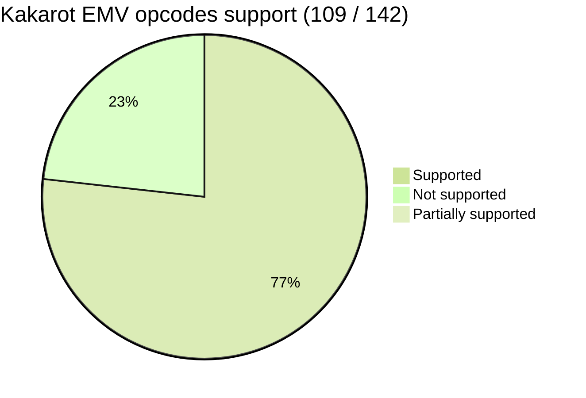

<p align="center">
    
</p>
<div align="center">
  <h3 align="center">
  EVM interpreter written in Cairo, a sort of ZK-EVM emulator, leveraging STARK proof system.
  </h3>
</div>


[](https://t.me/KakarotZkEvm)


[](https://twitter.com/KakarotZkEvm)

<div align="center">

**Kakarot** is an Ethereum Virtual Machine written in Cairo. It means it can be
deployed on StarkNet, a layer 2 scaling solution for Ethereum, and run an EVM
bytecode program. Hence, Kakarot can be used to run Ethereum smart contracts on
StarkNet. Kakarot is the super sayajin ZK-EVM ! Why ? Because:
`It's over 9000!!!!!`. It is a work in progress, and it is not ready for
production.

[Getting started](#getting-started) • [Supported opcodes](#supported-opcodes) •
[Build](#build) • [Test](#test) .
[Report a bug](https://github.com/sayajin-labs/kakarot/issues/new?assignees=&labels=bug&template=01_BUG_REPORT.md&title=bug%3A+)

</div>


## Supported opcodes



Here is the list of supported opcodes: [opcodes](docs/supported_opcodes.md)

For the moment the list is maintained manually, but it will likely be generated
automatically in the future. If you want to contribute, you can help us by
adding the missing opcodes. And if you implement a new opcode, please update the
list.

## Documentation

### Architecture

### Main execution flow


### Execution sample

Execution of a simple EVM bytecode program on Kakarot.

The bytecode is the following:

```console
6001600503600301610166016002026105b40460020500
```

Which corresponds to the following EVM program:

```console
0x60 - PUSH1
0x60 - PUSH1
0x03 - SUB
0x60 - PUSH1
0x01 - ADD
0x61 - PUSH2
0x01 - ADD
0x60 - PUSH1
0x02 - MUL
0x61 - PUSH2
0x04 - DIV
0x60 - PUSH1
0x05 - SDIV
0x00 - STOP
```

Here is the execution trace of the program on Kakarot:


## Installation

Install the requirements:

```bash
# install poetry if you don't have it already
# curl -sSL https://install.python-poetry.org | python3 -
make setup
```

For Mac M1s (using
[brew, miniforge and conda](https://towardsdatascience.com/how-to-easily-set-up-python-on-any-m1-mac-5ea885b73fab)):

```bash
brew install gmp
conda create --name cairo python=3.9
conda activate cairo
conda update -n base -c conda-forge conda
conda install pip
CFLAGS=-I`brew --prefix gmp`/include LDFLAGS=-L`brew --prefix gmp`/lib /opt/homebrew/Caskroom/miniforge/base/envs/cairo/bin/pip install ecdsa fastecdsa sympy
CFLAGS=-I`brew --prefix gmp`/include LDFLAGS=-L`brew --prefix gmp`/lib /opt/homebrew/Caskroom/miniforge/base/envs/cairo/bin/pip install cairo-lang cairo_coverage openzeppelin-cairo-contracts
```

## Build

```bash
make build
```

## Test

```bash
# Run all tests
make test

# Run only unit tests
make test-units

# Run only integration tests
make test-integration

# Run a specific test file
pytest <PATH_TO_FILE>  # with pytest
python3 -m unittest <PATH_TO_FILE>  # with unittest
```

## Deploy

```bash
# On testnet
./scripts/deploy_kakarot.sh -p testnet -a admin
```

With:

- `testnet` profile defined in protostar config file (testnet for alpha-goerli)
- `admin` alias to the admin account (optional if it is your `__default__`
  account, see also starknet account
  [documentation](https://starknet.io/docs/hello_starknet/account_setup.html))

Contract addresses will be logged into the prompt.

### Inputs

To manage inputs sent to constructor during the deployment, you can customize
the [config files](./scripts/configs/).

## License

**kakarot** is released under the [MIT](LICENSE).

## Security

Kakarot follows good practices of security, but 100% security cannot be assured.
Kakarot is provided **"as is"** without any **warranty**. Use at your own risk.

_For more information and to report security issues, please refer to our
[security documentation](docs/SECURITY.md)._

## Contributing

First off, thanks for taking the time to contribute! Contributions are what make
the open-source community such an amazing place to learn, inspire, and create.
Any contributions you make will benefit everybody else and are **greatly
appreciated**.

Please read [our contribution guidelines](docs/CONTRIBUTING.md), and thank you
for being involved!

## Contributors

<!-- ALL-CONTRIBUTORS-LIST:START - Do not remove or modify this section -->
<!-- prettier-ignore-start -->
<!-- markdownlint-disable -->
<!-- markdownlint-restore -->
<!-- prettier-ignore-end -->

<!-- ALL-CONTRIBUTORS-LIST:END -->

<p align="center">
    
</p>
