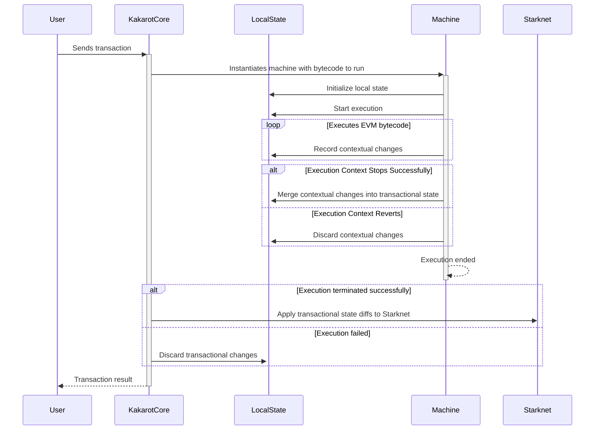

# Local State

A challenge with the implementation of Kakarot is that since it lives as a
contract deployed on chain, it cannot always manipulate the underlying state of
the blockchain once it has performed modifications on it to revert the changes
made. For example, a deployed contract cannot delete itself from the blockchain,
and emitted events cannot be deleted.

This means that before committing any changes to the blockchain, Kakarot must
ensure that the changes are valid. This is done by maintaining a local state
that is updated as the code is executed.

The machine is created along with a default empty state. The state is a struct
that wraps dictionaries holding the values stored in the blockchain storage
modified locally.

Because of technical limitations around the usage of dictionaries preventing us
from using dicts in self-referring data structures, instead of having one state
per execution context that we could merge into the parent state if the context
exits successfully or discard if the context reverts, we have one global `State`
structs that achieves the same behavior by tracking transactional changes, which
refers to the changes made inside the current transaction as a whole, and a
contextual changes, which refers to changes made inside the current execution
context.

The local state is updated as the code is executed, and when an execution
context is finalized, we merge the contextual state updates into the
transactional state. When a transaction finishes, we apply the transactional
state diffs by writing them inside the blockchain storage.

This design allows us to simulate reverting the changes made to the blockchain
storage by simply discarding the contextual state updates, and to commit the
changes by applying the transactional state updates.

The sequence diagram below illustrates how Kakarot interacts with both Starknet
storage and its local cached state.



<span class="caption">Interactions between Kakarot, its local state and Starknet
storage</span>

## Implementation

We need to be able to store in the local state the current information:

- The existing modified accounts content, including balance, nonce, code and
  storage updates,
- The emitted events,
- The newly created accounts,
- The deleted accounts through `self-destruct`
- The pending transfers of native tokens.

At the end of an execution context, we can merge the contextual state into the
transactional state, and at the end of a transaction, we can apply the
transactional state updates to the blockchain storage, emit pending events, and
perform actual token transfers.

## Implementation design

The state is implemented as a struct composed by `StateChangeLog` - for objects
that need to be overridden in the State - and `SimpleLog` data structures, for
objects that only need to be appended to a list. They are implemented as
follows:

```rust
struct State {
    /// Accounts states - without storage and balances, which are handled separately.
    accounts: StateChangeLog<Account>,
    /// Account storage states. `EthAddress` indicates the target contract,
    /// `u256` indicates the storage key.
    /// `u256` indicates the value stored.
    /// We have to store the target contract, as we can't derive it from the
    /// hashed address only when finalizing.
    accounts_storage: StateChangeLog<(EthAddress, u256, u256)>,
    /// Account states
    /// Pending emitted events
    events: SimpleLog<Event>,
    /// Account balances updates. This is only internal accounting and stored
    /// balances are updated when committing transfers.
    balances: StateChangeLog<u256>,
    /// Pending transfers
    transfers: SimpleLog<Transfer>,
}
```

<span class="caption">The State struct</span>

A `StateChangeLog` is a data structure that tracks the changes made to a
specific object both at the context-level and at the transaction-level using the
mechanism specified above. The `SimpleLog` is a simplified version of this
concept as an append-only data structure.

```rust
/// The `StateChangeLog` tracks the changes applied to storage during the execution of a transaction.
/// Upon exiting an execution context, contextual changes must be finalized into transactional changes.
/// Upon exiting the transaction, transactional changes must be finalized into storage updates.
///
/// # Type Parameters
///
/// * `T` - The type of values stored in the log.
///
/// # Fields
///
/// * `contextual_changes` - A `Felt252Dict` of contextual changes. Tracks the changes applied inside a single execution context.
/// * `contextual_keyset` - An `Array` of contextual keys.
/// * `transactional_changes` - A `Felt252Dict` of transactional changes. Tracks
/// the changes applied in the entire transaction.
/// * `transactional_keyset` - An `Array` of transactional keys.
struct StateChangeLog<T> {
    contextual_changes: Felt252Dict<Nullable<T>>,
    contextual_keyset: Array<felt252>,
    transactional_changes: Felt252Dict<Nullable<T>>,
    transactional_keyset: Array<felt252>
}
```

<span class="caption">The StateChangeLog generic struct</span>

```rust

/// `SimpleLog` is a straightforward logging mechanism.
///
/// This structure is designed to manage both contextual and transactional logs of a generic type `T`.
///
/// # Fields
///
/// - `contextual_logs`: Contains logs that are context-specific.
/// - `transactional_logs`: Contains logs that are transaction-wide.
#[derive(Drop)]
struct SimpleLog<T> {
    contextual_logs: Array<T>,
    transactional_logs: Array<T>,
}
```

<span class="caption">The SimpleLog generic struct</span>

Storage changes are modeled using a dictionary where the key is the storage
address to update, and the value is the updated value. However, we can't create
nested dictionaries in Cairo - so we have to separate the accounts storage
updates from the account updates themselves.
