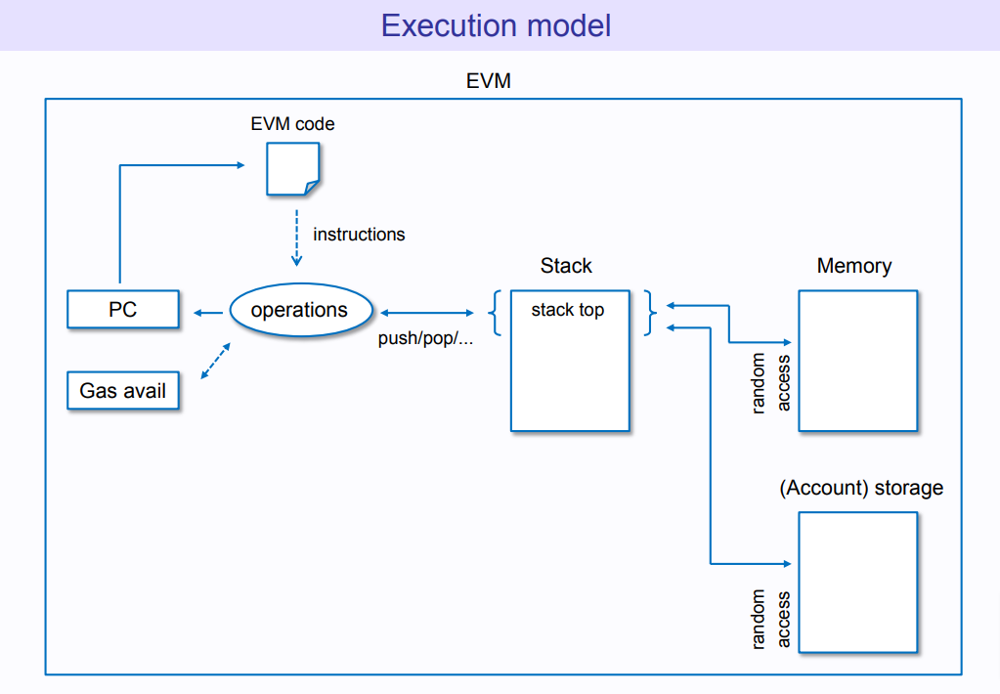

The EVM, or Ethereum Virtual Machine, is the runtime environment for smart contracts on the Ethereum blockchain. It is responsible for executing the code of these contracts and maintaining their state. It is a virtual machine, meaning that it is a software-based simulation of a physical machine. The EVM is responsible for enforcing the rules of the Ethereum protocol and ensuring that all transactions on the network are valid.
You can see it as the Operating System (OS) of Ethereum. But, as you don’t need to know how an OS works to use your laptop, you don’t need to know how EVM works to use Ethereum. That is surely why you’re reading this.

The reason Ethereum Protocol exists is to maintain the Ethereum Virtual Machine. It is hard to imagine the future of Starknet without its own implementation of EVM, this is why we are building it.

Kakarot is an implementation of the EVM, currently deployed as a smart-contract on Starknet.

EVM executes bytecode. Executing bytecode costs Gas. You technically can know how much Gas is needed by splitting the bytecode that will be executed into operations and adding the cost of all those operations (see https://ethereum.org/en/developers/docs/evm/opcodes).

If you want to deepdive into the subject here are some resources you may like:
- https://takenobu-hs.github.io/downloads/ethereum_evm_illustrated.pdf
- https://ethereum.org/en/developers/docs/evm
- https://ethereum.org/en/developers/tutorials/yellow-paper-evm
