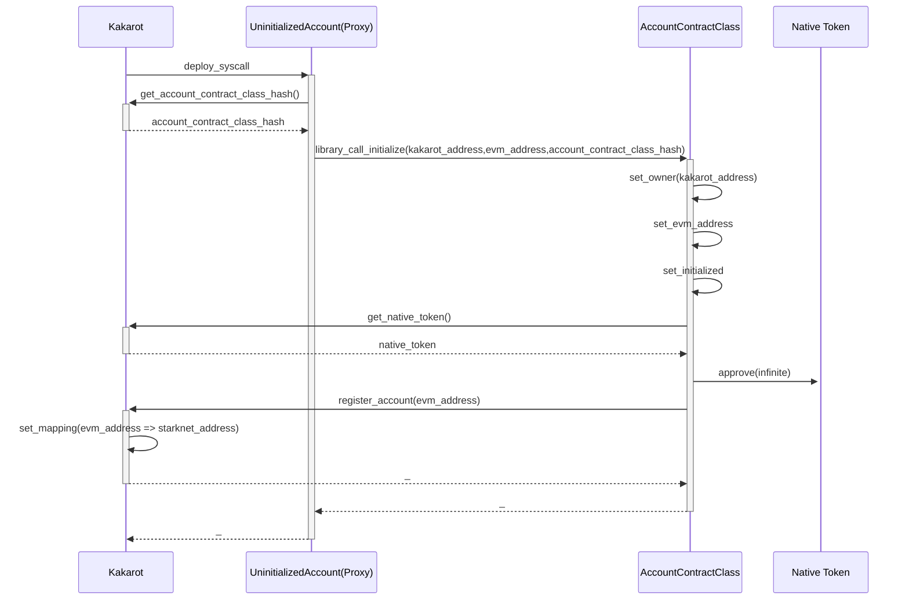
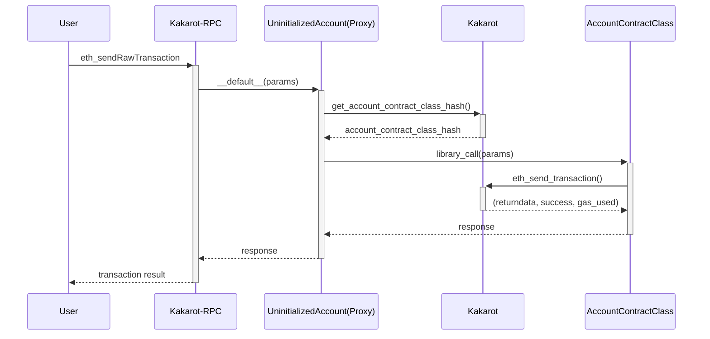

# Accounts in Kakarot

## Overview

Kakarot leverages Starknet's native Account Abstraction to provide a single
account type for both EOA (Externally Owned Account) and CA (Contract Account)
use cases.

## Account Structure

### Account Contract

All accounts in Kakarot are managed by a single Starknet contract class
(`account_contract.cairo`). This contract implements the required Starknet
Account Abstraction entrypoints, but they're disabled in favor of the
`execute_from_outside` entrypoint. `execute_from_outside` accepts transactions
sent by relayers to leverage applicative paymaster features.

### Account Storage

Account contracts store the following information:

- `storage`: A mapping from 32-byte keys to 32-byte values (EVM account
  storage).
- `nonce`: A 64-bit value representing the number of transactions sent from the
  account.
- `bytecode`: The EVM bytecode of the account.
- `is_initialized`: A boolean indicating whether the account has been
  initialized.
- `evm_address`: The Ethereum address associated with this Starknet account.
- `code_hash`: The hash of the EVM contract account bytecode.
- `valid_jumpdests`: A mapping of bytecode-indexes to booleans indicating
  whether the destination is a valid jump destination. Analyzed at deploy time.
- `authorized_message_hashes`: A mapping of message hashes to booleans
  indicating whether the message has been authorized. Used to whitelist hashes
  of specific pre-eip155 transactions.

## Deterministic Address Mapping

Kakarot uses a deterministic system to compute the address of an account
contract from an Ethereum address. The Starknet contract address is derived
from:

1. The hash of the Starknet contract class
2. A salt (using the Ethereum address)
3. Constructor arguments: `[1, evm_address]`
4. The deployer address (always the Kakarot contract)

This system ensures a one-to-one mapping between Ethereum and Starknet
addresses.

It is recommended to use the `get_starknet_address` on the Kakarot contract to
get the Starknet address of an EVM account, in case the contract class hash
changes in the future.

## Account Deployment and Initialization

Kakarot uses a proxy pattern for account deployment:

1. All accounts are deployed as instances of the `uninitialized_account` class,
   which acts as a transparent proxy.
2. The actual account implementation is stored in the Kakarot contract.
3. During initialization, the account is registered in Kakarot's mapping of EVM
   addresses to Starknet addresses.

The deployment process is illustrated as follows:

## Transaction Execution

Transactions in Kakarot are executed through the proxy pattern:

1. The `uninitialized_account` proxy receives the transaction.
2. The `__default__` entrypoint delegates the call to the current account
   implementation.
3. The actual execution is performed through a library call to the account
   implementation.

The execution process is as follows:

This approach ensures that all Kakarot accounts remain up-to-date and function
consistently, regardless of when they were created or last used.
