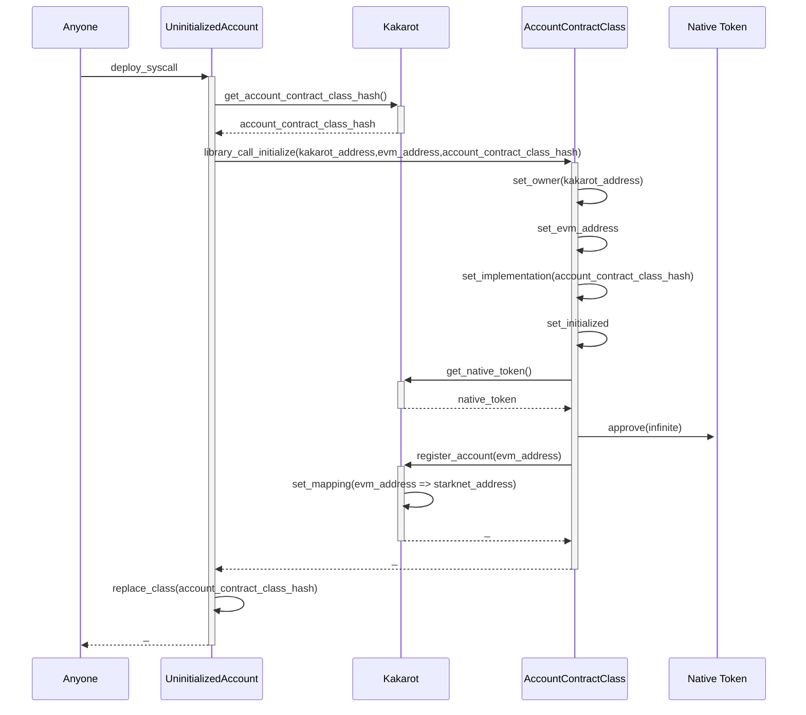
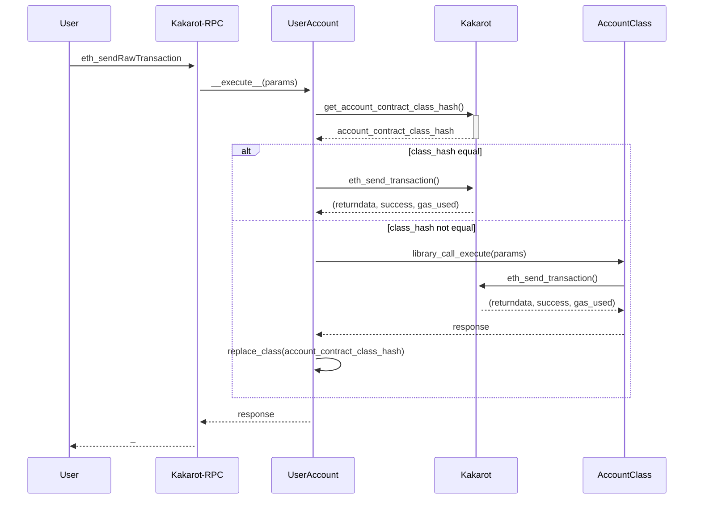

# Accounts

While the EVM defines two types of accounts (EOAs and CAs), Starknet only has
one type of account. There is no distinction between accounts managed by a
private key and a wallet (EOAs) and smart contracts, due to native Account
Abstraction.

Kakarot leverages this abstraction to provide a single account type that can be
used for both EOA and CA use cases. This account type is managed by a single
Starknet contract class (`account_contract.cairo`). This contract class defines
the `__validate__` and `__execute__` entrypoints, which are used to send
transactions from a wallet to Kakarot in a way that is compatible with the
Starknet infrastructure. If you own the keys to an Ethereum address, you can use
the `deploy_externally_owned_account` entrypoint to deploy a corresponding
Starknet account contract, whose address is deterministic based on the Ethereum
address.

Although our backend makes no distinction between EOA and CA, the validation
logic will reject any transaction that originates from a contract that has EVM
code, as per the EVM specification. In the (extremely unlikely) event that a
user sends a transaction from a contract account after mining the private key
corresponding to an EOA, the transaction will be rejected.

## Account storage

Account contracts store the following information:

- `storage`: A mapping from 32-byte keys to 32-byte values. This is used to
  store the values stored in the EVM account storage.
- `nonce`: A 64-bits value representing the number of transactions sent from the
  account. Even though EOAs do not use the stored nonce for validation, it is
  still stored in the account contract to ensure the stored nonce always matches
  the protocol nonce, which is incremented by one by the sequencer for each
  transaction.
- `bytecode`: The EVM bytecode of the account. This is only used for CAs, as
  EOAs do not have bytecode.
- `version`: A 9-digit integer representing the version of the account contract,
  in the format `major.minor.patch` (3 digits each).
- `implementation`: The class hash of the current account contract class.
- `is_initialized`: A boolean indicating whether the account has been
  initialized, used to prevent reinitializing an already initialized account.
- `evm_address`: The Ethereum address associated with this Starknet account.

## Account entrypoints

The account contract class provides entrypoints to query and set the account
storage, nonce, and bytecode. These entrypoints are used by the Kakarot contract
to update the account state after a successful transaction. Even in the case of
a reverted transaction, the nonce of the transaction sender is incremented, to
ensure that the nonce stored in the account contract always matches the protocol
nonce.

The account contract class also provides entrypoints related to account
management: the current implementation hash, the version of the account contract
class, and the Ethereum address associated with the account. These entrypoints
are used to verify the account state and to upgrade the account contract class.

The account contract class also has `__validate__` and `__execute__`
entrypoints, as per the
[https://docs.starknet.io/documentation/architecture_and_concepts/Accounts/account_functions/](Starknet
specification), which are used to process transactions originating from EOAs.
These entrypoints are called by the sequencer when a transaction is submitted to
the sequencer. The `__validate__` entrypoint first checks if the transaction is
valid, and the `__execute__` entrypoint processes the transaction if it is
valid. While it is technically feasible to submit multiple EVM transactions in a
single multicall, the current implementation only supports submitting one EVM
transaction per invoke transaction.

## Deterministic mapping of addresses

The account model allows us to compute the address of an account contract from
an Ethereum address. The address of a starknet contract is computed from the
following inputs:

- The hash of the starknet contract class.
- A salt, for which we use the Ethereum address.
- Eventual constructor arguments. We use the address of the Kakarot contract and
  the Ethereum address of the account as constructor arguments.
- The deployer address, or zero. In our case, we always deploy from zero.

This system ensures a deterministic calculation of the starknet contract address
from an Ethereum address. However, this requires all inputs to be immutable, as
changing any input will result in a different starknet contract address. This
requires a deployment process, where we first deploy a contract using a
restricted class that will always stay immutable (`uninitialized_account`), and
then upgrade the class of the contract to the desired account class using the
most up-to-date class. Anyone can deploy an account contract using the
`deploy_externally_owned_account` entrypoint from Kakarot, or do the same
manually using the `deploy` syscall.

When an account is deployed, we make a library call to the `initialize` selector
of its new implementation. This implementation is read directly from the storage
of the Kakarot contract, so that newly deployed accounts are always up-to-date.
In this initialization, we give infinite allowance to the Kakarot contract for
the native token, we register the account in the Kakarot mapping of evm
addresses to starknet addresses, and we set the `is_initialized` flag to true to
prevent accounts from being initialized twice.

The deployment process is illustrated as follows:

## Account versioning

Kakarot's account versioning system allows for upgrading the account contract
class without affecting the address of an account and the subsequent deployment
of accounts. The upgrade process works as follows:

1. The account contract class exposes an `upgrade` entrypoint, which allows the
   owner of the account to upgrade the account contract class to a new version.
   Only the owner of the account can upgrade the account contract class.
2. Accounts have a `version` field that stores the version of the account
   contract class.
3. The `version` field should be a 9-digit integer, where the first 3 digits
   represent the major version, the next 3 digits represent the minor version,
   and the last 3 digits represent the patch version.
4. Upgrading an account will not change the content of the account storage. It
   will only change the implementation logic.

## Upgrading accounts with AA

One proposal for seamless upgrades would be to check if an account's class hash
matches the one defined in the Kakarot contract every time we execute a
transaction. If not, we would call the `upgrade` entrypoint of the account
contract to update its class, and then proceed with the transaction by executing
a `library_call` to the new class with the transaction to execute. The class
upgrade would only be effective at the end of the transaction, but since we
would execute the transaction through a library call, the transaction sent would
be executed in the context of the latest account version.

