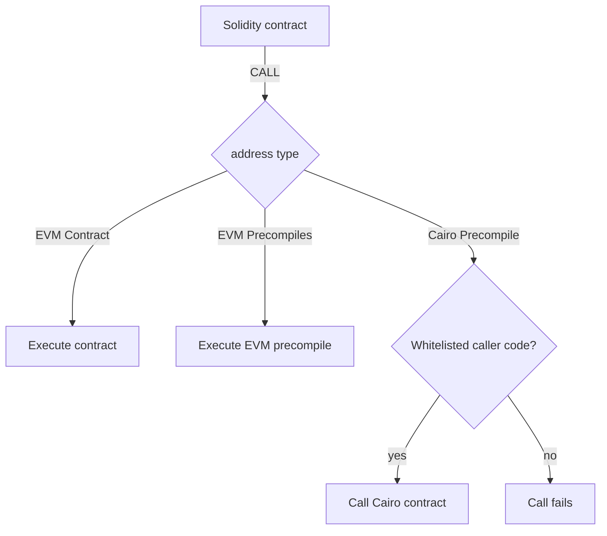

# Cairo Precompile

Kakarot zkEVM being a Starknet appchain, it is possible to run Cairo Contracts on Kakarot.
The address 75001 is reserved for the "Cairo precompile", that lets you invoke Cairo contracts from EVM contracts.
To interact with the Cairo precompile, you can use the solidity CairoLib from your solidity contracts.

## Requirements

From a developer / user perspective, the precompiles should be easy to interact
with from EVM contracts. As such, we need to provide a way to call the
precompiles from EVM contracts, and to return the results to the EVM contracts.
This involves:

- Converting the EVM calldata to Cairo inputs
- Converting the Cairo outputs to EVM return data

From a security perspective, the precompiles should _never_ produce Cairo errors
that would cause the transaction to revert. As we cannot catch contract call
errors in Cairo, we need to ensure that executing a `call_contract` syscall to a
precompile will never cause the transaction to revert, meaning that:

- The target Cairo addresses should always correspond to a deployed contract
- The selector of the Cairo function being called should always be present in
  the contract called
- The Cairo contract called should never _panic_

From these principles, we can derive the following design.

## Design

Interacting with the Cairo precompiles will only be done by calling specific EVM
contracts that have been whitelisted for this purpose. This ensures that the
Cairo precompiles are only called by contracts that have been reviewed and
approved regarding the security concerns mentioned above.

As such, the execution flow of an EVM message will be as follows:



## Implementation

The solidity part for the Cairo precompiles includes a library that allows
developers to interact with the Cairo precompiles. This library contains methods
to call a Cairo contract or class, either via `call` or `staticcall`.

> Note: The behavior of high-level `calls` in solidity prevents calling
> precompiles directly. As such, the library will use the low-level `call` and
> `staticcall` opcodes to interact with these Cairo precompiles.

```solidity
// SPDX-License-Identifier: MIT
pragma solidity >=0.7.0 <0.9.0;

library CairoLib {
    /// @dev The Cairo precompile contract's address.
    address constant CAIRO_PRECOMPILE_ADDRESS = 0x0000000000000000000000000000000000075001;

    /// @notice Performs a low-level call to a Cairo contract deployed on the Starknet appchain.
    /// @dev Used with intent to modify the state of the Cairo contract.
    /// @param contractAddress The address of the Cairo contract.
    /// @param functionSelector The function selector of the Cairo contract function to be called.
    /// @param data The input data for the Cairo contract function.
    /// @return returnData The return data from the Cairo contract function.
    function callContract(
        uint256 contractAddress,
        uint256 functionSelector,
        uint256[] memory data
    ) internal returns (bytes memory returnData);

    /// @notice Performs a low-level call to a Cairo contract deployed on the Starknet appchain.
    /// @dev Used with intent to read the state of the Cairo contract.
    /// @param contractAddress The address of the Cairo contract.
    /// @param functionSelector The function selector of the Cairo contract function to be called.
    /// @param data The input data for the Cairo contract function.
    /// @return returnData The return data from the Cairo contract function.
    function staticcallContract(
        uint256 contractAddress,
        uint256 functionSelector,
        uint256[] memory data
    ) internal view returns (bytes memory returnData);


    /// @dev Performs a low-level call to a Cairo class declared on the Starknet appchain.
    /// @param classHash The class hash of the Cairo class.
    /// @param functionSelector The function selector of the Cairo class function to be called.
    /// @param data The input data for the Cairo class function.
    /// @return returnData The return data from the Cairo class function.
    function libraryCall(
        uint256 classHash,
        uint256 functionSelector,
        uint256[] memory data
    ) internal view returns (bytes memory returnData);
}

```

> The full library can be found in
> [CairoLib.sol](../../solidity_contracts/src/CairoPrecompiles/CairoLib.sol)

It contains three functions, `callContract`, `staticcallContract` and
`libraryCall` that allow the user to call a Cairo contract or class deployed on
the Starknet appchain. The method takes three arguments:

- `contractAddress` or `classHash`: The address of the Cairo contract to call /
  class hash to call
- `functionSelector`: The selector of the function to call, as `sn_keccak` of
  the entrypoint name.
- `data`: The calldata to pass to the Cairo contract, as individual bytes.

Contract developers can use this library to interact with the Cairo precompiles.
Let's take an example of a contract that calls a Cairo contract to increment a
counter:

```rust
#[starknet::contract]
pub mod Counter {
    #[storage]
    struct Storage{
        counter: u256
    }

    #[external(v0)]
    pub fn inc(ref self: ContractState) {
        self.counter.write(self.counter.read() + 1);
    }

    #[external(v0)]
    pub fn set_counter(ref self: ContractState, new_counter: u256) {
        self.counter.write(new_counter);
    }

    #[external(v0)]
    pub fn get(self: @ContractState) -> u256 {
        self.counter.read()
    }

}
```

Calling this contract from an EVM contract would look like this:

```solidity
// SPDX-License-Identifier: MIT
pragma solidity >=0.7.0 <0.9.0;

import {CairoLib} from "kakarot-lib/Cairolib.sol";

contract CairoCounterCaller  {
    /// @dev The cairo contract to call
    uint256 cairoCounter;

    /// @dev The cairo function selector to call - `inc`
    uint256 constant FUNCTION_SELECTOR_INC = uint256(keccak256("inc")) % 2**250;

    /// @dev The cairo function selector to call - `set_counter`
    uint256 constant FUNCTION_SELECTOR_SET_COUNTER = uint256(keccak256("set_counter")) % 2**250;

    /// @dev The cairo function selector to call - `get`
    uint256 constant FUNCTION_SELECTOR_GET = uint256(keccak256("get")) % 2**250;


    constructor(uint256 cairoContractAddress) {
        cairoCounter = cairoContractAddress;
    }

    function getCairoCounter() public view returns (uint256 counterValue) {
        // `get_counter` takes no arguments, so data is empty
        uint256[] memory data;
        bytes memory returnData = CairoLib.staticcallContract(cairoCounter, FUNCTION_SELECTOR_GET, data);

        // The return data is a 256-bit integer, so we can directly cast it to uint256
        return abi.decode(returnData, (uint256));
    }

    /// @notice Calls the Cairo contract to increment its internal counter
    function incrementCairoCounter() external {
        // `inc` takes no arguments, so data is empty
        uint256[] memory data;
        CairoLib.callContract(cairoCounter, FUNCTION_SELECTOR_INC, data);
    }

    /// @notice Calls the Cairo contract to set its internal counter to an arbitrary value
    /// @dev The counter value is split into two 128-bit values to match the Cairo contract's expected inputs (u256 is composed of two u128s)
    /// @param newCounter The new counter value to set
    function setCairoCounter(uint256 newCounter) external{
        // The u256 input must be split into two u128 values to match the expected cairo input
        uint128 newCounterLow = uint128(newCounter);
        uint128 newCounterHigh = uint128(newCounter >> 128);

        uint256[] memory data = new uint256[](2);
        data[0] = uint256(newCounterLow);
        data[1] = uint256(newCounterHigh);
        CairoLib.callContract(cairoCounter, FUNCTION_SELECTOR_SET_COUNTER, data);
    }
}

```

Once deployed, the contract can be called to increment the counter in a Cairo
contract deployed at starknet address `cairoCounter`. The deployment address
will need to be communicated to Kakarot for the precompile to be whitelisted.

Internally, a new logic flow is implemented when processing message calls. If
the target address is the Cairo precompile address, we check if the code_address
of the message is whitelisted. If it is, we execute the Cairo contract. If it is
not, we revert the transaction.

To execute the Cairo contract, we need to convert the EVM calldata, expressed as
a `bytes`, to the expected Cairo calldata format `Array<felt252>`. In Solidity,
the `data` sent with the call will be represented as a `uint256[]`, where each
`uint256` element will be cast to a `felt252` in Cairo. Therefore, each 256-bit
word sequence in the EVM calldata must correspond to an element of at most 251
bits, which is Cairo's native field element size. If the value being passed is
less than 251 bits, it can be directly cast to a `felt252` in Cairo.

For example, consider the `setCairoCounter` function mentioned above. If we want
to increase the counter by 1, the `data` in Solidity would be:

```solidity
uint256[] memory data = new uint256[](2);
data[0] = 0;
data[1] = 1;
```

In this case, the Cairo expected input is a `u256`, which is composed of two
`felt` values. Therefore, the `newCounter` value is split into two values
smaller than the field element size, and the resulting `data` array is of
size 2.

Similarly, the return data of the Cairo contract is deserialized into a
`uint256[]` where each returned felt has been cast to a uint256.

> Note: It is left to the responsibility of the wrapper contract developer to
> ensure that the calldata is correctly serialized to match the Cairo contract's
> expected inputs, and to properly deserialize the return data into the expected
> type.
