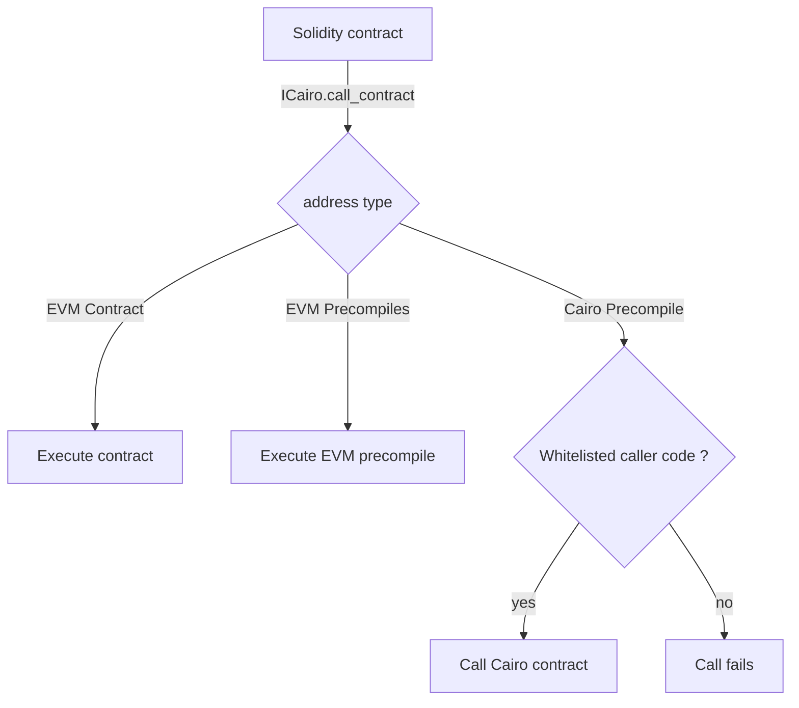

# Cairo Precompiles

Kakarot zkEVM being a Starknet appchain, it is technically possible to run Cairo
Contracts on Kakarot. The purpose of this document is to explain the design
behind the Cairo precompiles, which are the Cairo contracts that are deployed on
Kakarot to provide additional functionality to the users.

## Requirements

From a developer / user perspective, the precompiles should be easy to interact
with from EVM contracts. As such, we need to provide a way to call the
precompiles from EVM contracts, and to return the results to the EVM contracts.
This involves:

- Converting the EVM calldata to Cairo inputs
- Converting the Cairo outputs to EVM return data

From a security perspective, the precompiles should _never_ produce Cairo errors
that would cause the transaction to revert. As we cannot catch contract call
errors in Cairo, we need to ensure that executing a `call_contract` syscall to a
precompile will never cause the transaction to revert, meaning that:

- The target Cairo addresses should always correspond to a deployed contract
- The selector of the Cairo function being called should always be present in
  the contract called
- The Cairo contract called should never _panic_

From these principles, we can derive the following design.

## Design

Interacting with the Cairo precompiles will only be done by calling specific EVM
contracts that have been whitelisted for this purpose. This ensures that the
Cairo precompiles are only called by contracts that have been reviewed and
approved regarding the security concerns mentioned above.

As such, the execution flow of an EVM message will be as follows:



## Implementation

The solidity interface for the Cairo precompiles is as follows:

```solidity
// SPDX-License-Identifier: MIT

pragma solidity >=0.7.0 <0.9.0;

/// @notice Solidity interface that allows developers to interact with Cairo precompile methods. The precompile has one method `call_contract`.

/// @dev The Cairo precompile contract's address.
address constant CAIRO_PRECOMPILE_ADDRESS = 0x00000000000000000000000000000000000AbDe1;

/// @dev The Cairo precompile contract's instance.
ICairo constant CAIRO_PRECOMPILE_CONTRACT = ICairo(CAIRO_PRECOMPILE_ADDRESS);

interface ICairo {
    /// @dev Call Cairo contract deployed on the Starknet appchain
    function call_contract(uint256 contractAddress, uint256 functionSelector, bytes calldata data) external returns (bytes memory);
}
```

It contains a single method `call_contract` that allows the user to call a Cairo
contract deployed on the Starknet appchain. The method takes three arguments:

- `contractAddress`: The address of the Cairo contract to call
- `functionSelector`: The selector of the function to call, as `sn_keccak` of
  the entrypoint name.
- `data`: The calldata to pass to the Cairo contract, as individual bytes.

Contract developers can use this interface to interact with the Cairo
precompiles. Let's take an example of a contract that calls a Cairo contract to
increment a counter:

```rust
#[starknet::contract]
pub mod Counter {
    #[storage]
    struct Storage{
        counter: u256
    }

    #[external(v0)]
    pub fn inc(ref self: ContractState) {
        self.counter.write(self.counter.read() + 1);
    }

    #[external(v0)]
    pub fn set_counter(ref self: ContractState, new_counter: u256) {
        self.counter.write(new_counter);
    }

}
```

Calling this contract from an EVM contract would look like this:

```solidity
// SPDX-License-Identifier: MIT

pragma solidity >=0.7.0 <0.9.0;

import "./ICairo.sol";

contract MyContract {
    /// @dev The Cairo precompile contract's instance.

    /// @dev The cairo contract to call - assuming it's deployed at address 0xabc
    uint256 constant CAIRO_CONTRACT_ADDRESS = 0xabc;

    /// @dev The cairo function selector to call - `inc()`
    uint256 constant FUNCTION_SELECTOR_INC =
    0x03b82f69851fa1625b367ea6c116252a84257da483dcec4d4e4bc270eb5c70a7;

    /// @dev The cairo function selector to call - `set_counter()`
    uint256 constant FUNCTION_SET_COUNTER = 0x0107cf8c3d109449e1beb4ac1ba726d3673b6f088ae454a9e0f18cb225be4712;

    /// @notice Calls the Cairo contract to increment its internal counter
    /// @return The return data of the call, serialized as bytes
    function incrementCairoCounter() public returns (bytes memory) {
        // `inc` takes no arguments, so data is empty
        bytes memory data = "";

        return CAIRO_PRECOMPILE_CONTRACT.call_contract(CAIRO_CONTRACT_ADDRESS, FUNCTION_SELECTOR_INC, data);
    }

    /// @notice Calls the Cairo contract to set its internal counter to an arbitrary value
    /// @dev The counter value is split into two 128-bit values to match the Cairo contract's expected inputs (u256 is composed of two u128s)
    /// @param newCounter The new counter value to set
    /// @return The return data of the call, serialized as bytes
    function setCairoCounter(uint256 newCounter) public returns (bytes memory) {
        uint128 newCounterLow = uint128(newCounter);
        uint128 newCounterHigh = uint128(newCounter >> 128);
        bytes memory data = abi.encode(newCounterLow, newCounterHigh);

        return CAIRO_PRECOMPILE_CONTRACT.call_contract(CAIRO_CONTRACT_ADDRESS, FUNCTION_SET_COUNTER, data);
    }
}
```

Once deployed, the contract can be called to increment the counter in a Cairo
contract deployed at address `0xabc`. The deployment address will need to be
communicated to Kakarot for the precompile to be whitelisted.

Internally, a new logic flow is implemented when processing message calls. If
the target address is the Cairo precompile address, we check if the code_address
of the message is whitelisted. If it is, we execute the Cairo contract. If it is
not, we revert the transaction.

To execute the Cairo contract, we need to convert the calldata in bytes to the
expected Cairo inputs, serialized to an `Array<felt252>`. This serialization
process must be done upfront, in the Solidity contract, before calling the
precompile. Each 256-bit word in the calldata is truncated to 251 bit and packed
into a `felt252`. The resulting `Array<felt252>` is then passed to the
precompile. Similarly, the return data of the Cairo contract is deserialized
into 32-bytes words, and stored in the return data of the EVM call.

> Note: It is left to the responsibility of the wrapper contract developer to
> ensure that the calldata is correctly serialized to match the Cairo contract's
> expected inputs, and to properly deserialize the return data.
