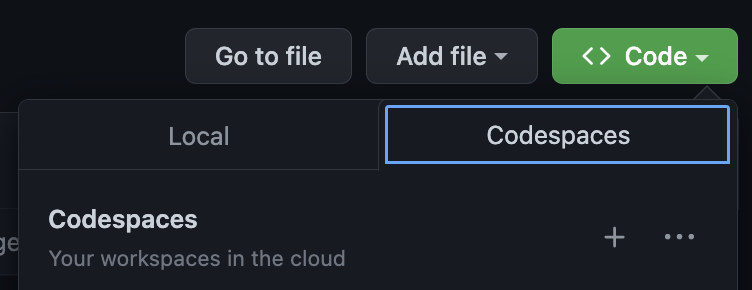
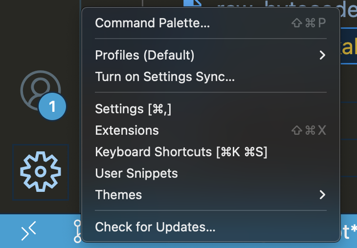
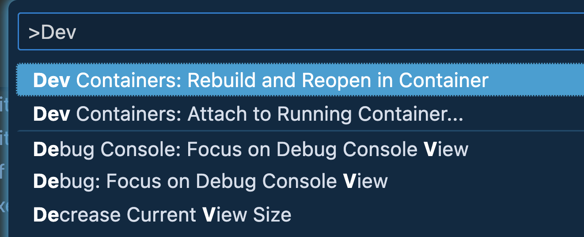
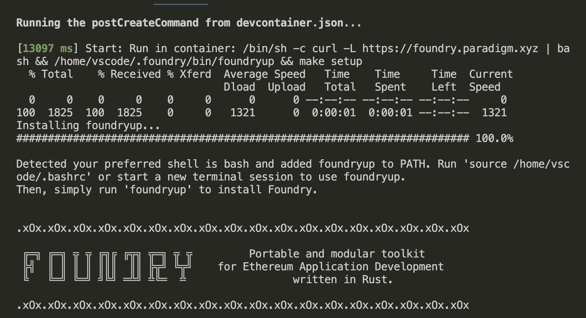
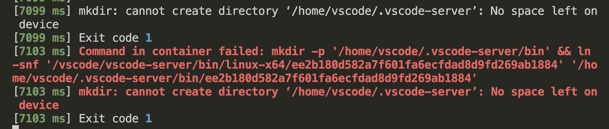
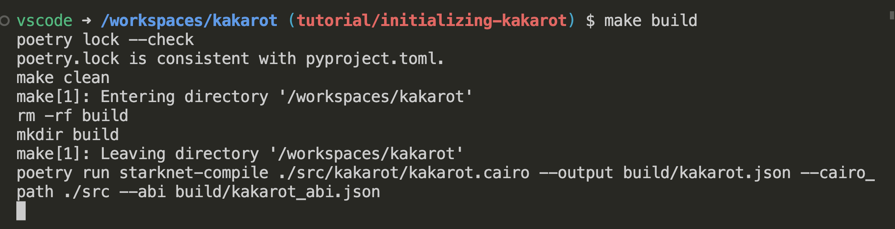
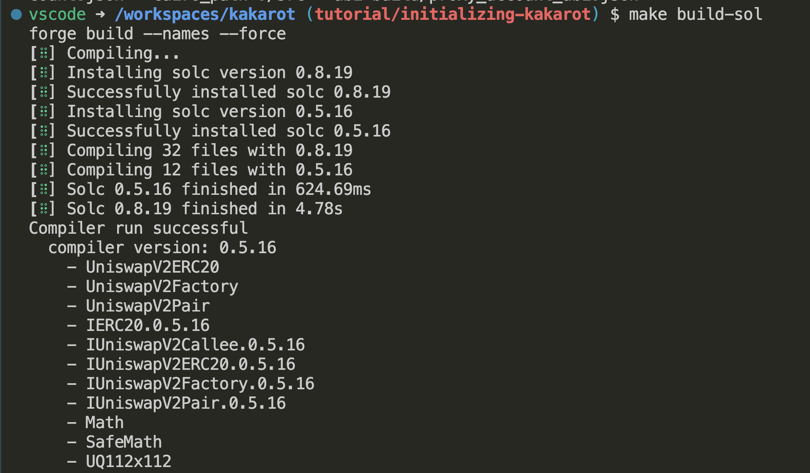

# How to initialize Kakarot Environment to deploy Solidity Smart Contracts

## Objective

To get started, it's essential to learn the basics of how Kakarot works. Once you have a solid understanding, you can proceed to set up the environment for deploying Solidity smart contracts. By following a step-by-step process, you'll be able to create an environment that is conducive to efficient and effective smart contract deployment.
Overall, learning how to use Kakarot and setting up the environment for deploying Solidity smart contracts locally will greatly benefit your blockchain development efforts.

## What is Kakarot?

Kakarot is a zkEVM written in Cairo. This means that we can develop decentralized applications (dApps) using Solidity and leverage Ethereum ecosystem tools such as Hardhat, Foundry, Slither and Metamask.

The key differentiator is its scalability, which is provided by StarkNet.

## Let's start to Build

`In this tutorial We will run Kakarot with` [devcontainers](https://code.visualstudio.com/docs/devcontainers/containers) `in our local machine`.

* Prerequisites:

  * [Git](https://git-scm.com/) installed.
  * [VS Code Dev Containers](ms-vscode-remote.remote-containers) installed.
  * [Basic understanding of docker](https://docs.docker.com/get-started/)
  * Basic knowledge of terminal to execute commands.

** If you prefer you can execute this repo directly in codespaces.


### Step 1: Clone this repo

```bash
  git clone git@github.com:sayajin-labs/kakarot.git
```

### Step 2: Open the project in VS Code

Once the repository is cloned, let's open the project in VS Code.  
Then we will check some important files:

* .devcontainer DIR contains a JSON file with the same name, this file describes how VS Code should start the container and what to do after it connects.

In this case we will use a container image with python3.9

```json
"image": "mcr.microsoft.com/vscode/devcontainers/python:0-3.9",
```

<p align="right">(<a href="https://code.visualstudio.com/docs/devcontainers/create-dev-container" target="_blank">See more</a>)
</p>

* scripts DIR contains [`deploy_kakarot.py`](../../../scripts/deploy_kakarot.py) file which executes the kakarot deployment.

* [Makefile](../../../Makefile) contains the commands that we have to execute for build and test tasks.

* pyproject.toml contains the build system requirements of Python projects  
This solves the build-tool dependency chicken and egg problem, i.e. pip can read `pyproject.toml` and what version of setuptools one may need.

<p align="right">(<a href="#readme-top">back to top</a>)</p>

### Step 3: We will execute devcontainer.json

* For this step we need to run Docker in our local machine, at this moment I am using docker version 20.10.20

We have to open the VS Code Command Palette with `⇧⌘P` or click in manage



and tap `> Dev Containers: Rebuild and Reopen in Container`



if this command works well you can see a mesagge like this in your vs code terminal



if you get some error about the space in the device like this:



[Check this link](https://github.com/microsoft/vscode-dev-containers/issues/128) about how to solve this error.

### Step 4: Check and deploy Kakarot

Now our Kakarot container is running, and We will run some commands to verify that is working well.  

The fisrt one is `make build` and you will see a meessage like the following



For the next command We will execute the tests for Solidity Smart Contracts with `make build-sol`.  


