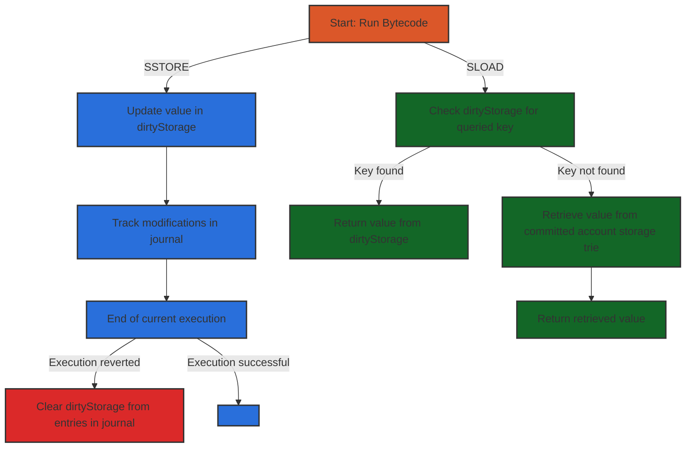
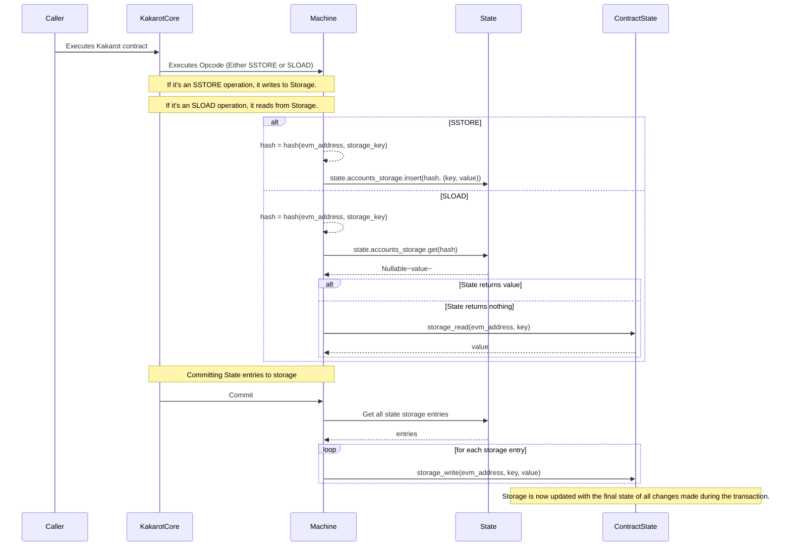

# Kakarot Storage

## Storage in Ethereum

The top-level data structure that holds information about the state of the
Ethereum blockchain is called the _world state_, and is a mapping of Ethereum
addresses (160-bit values) to accounts. Each Ethereum address represents an
account composed by a _nonce_, an _ether balance_, a _storage_, and a _code_. We
make the distinction between EOA (Externally Owned Accounts) that have no code
and an empty storage, and contracts that can have code and storage.


_Account state associated to an Ethereum address. Source:
[EVM Illustrated](https://takenobu-hs.github.io/downloads/ethereum_evm_illustrated.pdf)_

In traditional EVM clients, like Geth, the _world state_ is stored as a _trie_,
and information about account are stored in the world state trie and can be
retrieved through queries. Each account in the world state trie is associated
with an account storage trie, which stores all of the information related to the
account. When Geth updates the storage of a contract by executing the SSTORE
opcodes, it does the following:

- It updates the `value` associated to a `key` of the storage of a contract
  deployed at a specific `address`. However, it updates a `dirtyStorage`, which
  refers to storage entries that have been modified in the current transaction
  execution.
- It tracks the storage modifications in a `journal` so that it can be reverted
  in case of a revert opcode or an exception in the transaction execution.
- At the end of the execution of a transaction, all dirty storage slots are
  copied across to `pendingStorage`, which in turn is copied across to
  `originStorage` when the trie is finally updated. This effectively updates the
  storage root of the account state.

The behavior for the SLOAD opcode is very complementary to the SSTORE opcode.
When Geth executes the SLOAD opcode, it does the following:

- It starts by doing a check on `dirtyStorage` to see if it contains a value for
  the queried key, and returns it if so.
- Otherwise, it retrieves the value from the committed account storage trie.

Since one transaction can access a storage slot multiple times, we must ensure
that the result returned is the most recent value. This is why Geth first checks
`dirtyStorage`, which is the most up-to-date state of the storage.



<span class="caption">_Simplified representation of SSTORE and SLOAD Opcodes
behavior in the Geth EVM Client_ </span>

## Storage in Kakarot

As Kakarot is a contract that is deployed on Starknet and is not a client that
can directly manipulate a storage database, our approach differs from one of a
traditional client. We do not directly manipulate tries. Instead, we have access
to contracts storage on the Starknet blockchain, that we can query using
syscalls to read and update the value of a of a storage slot.

There are two different ways of handling Storage in Kakarot.

### One storage space per Kakarot Contract

The first approach is to have one storage space per Kakarot contract. This means
that for every contract that is deployed on Kakarot, we will deploy an
underlying Starknet contract, which has its own state which can only be queried
by itself.

This design closely resembles the design of the EVM. It has the following
properties:

- The two different kinds of EVM accounts - Externally Owned Accounts (EOA) and
  Contract Accounts (CA) - are both represented by Starknet smart contracts.
  Each EVM account is mapped to a unique Starknet contract. Each contract
  account has its own storage, and has external functions that can be called by
  Kakarot to read and write to its storage.
- Each contract is deployed by Kakarot, and contains its own bytecode in storage
  in the case of a smart contract (as EOAs don't have code)
- Each contract account has external functions that can be called by Kakarot to
  read the bytecode it stores and to read / write to its storage. This makes
  Kakarot an effective "admin" to all contracts with rights to modify their
  storage.

This design has some limitations:

- We perform a `call_contract_syscall` for each SLOAD/SSTORE operation that is
  committed to Starknet, which has an extra overhead compared to directly
  modifying the current contract's storage . Given that only KakarotCore can
  modify the storage of a Kakarot contract, we could directly store the whole
  world state in the main Kakarot contract storage.
- It adds external entrypoints with admin rights to read and write from storage
  in each Kakarot contract, which adds security risks.
- It moves away from the traditional EVM design, in which execution clients
  store account states in a common database backend.

However, it has some interesting properties. It allows us to have a one-to-one
mapping between Kakarot contracts and Starknet contracts, which makes it easier
to perform value transfers with the chain's native token. Moreover, it allows
one to send funds from a Starknet account to a Kakarot account, which can be
useful to implement a bridging mechanism to Kakarot with low overhead, or any
other mechanism that requires interacting with funds of a Kakarot account.

Considering the compatibility properties, we will use this design in Kakarot.
The second design, presented after, still has some interesting properties that
we will discuss. But the benefits it brings do not outweigh the loss of
compatibility.

### A shared storage space for all Kakarot Contracts

The second approach is to have a unified storage space for all contract accounts
in the main Kakarot smart contract. While Kakarot is not a traditional Ethereum
Client, we can still use a design that is similar. Traditional clients hold a
state database in which the account states are stored. We can do the same, but
instead of storing the account states in a database, we store them in the
KakarotCore contract storage. Therefore, we do not need to deploy a Starknet
contract for each Kakarot account contract, which saves users costs related to
deploying contracts.

A contract’s storage on Starknet is a persistent storage space where you can
read, write, modify, and persist data. The storage is a map with $2^{251}$
slots, where each slot is a `felt252` which is initialized to 0.

This new model doesn't expose read and write methods on Kakarot contracts.
Instead of having $n$ contracts with `write_storage` and `read_storage`
entrypoints, the only way to update the storage of a Kakarot contract is now
through executing SLOAD / SSTORE internally to KakarotCore.

Regarding the security of such a design, we can reason about the probability of
a collision occurring when interacting with this shared storage.
[65M contracts](https://dune.com/queries/2284893/3744521) have been deployed on
Ethereum so far. If we assume that Kakarot could reach the same number of
contracts, that would leave us with a total of
$2^{251} / 65\cdot10^6 \approx 2^{225}$ slots per contract. Even with a
hypothetical number of 100 billion contracts, we would still have around
$2^{214}$ storage slots available per contract.

Considering the birthday paradox, the probability of a collision occurring,
given $2^{214}$ randomly chosen slots, is roughly $1/2^{107}$. This is a very
low probability, which is considered secure by today's standards. We can
therefore consider that the collision risk is negligible and that this storage
layout doesn't introduce any security risk to Kakarot. For reference, Ethereum
has 80 bits of security on its account addresses, which are 160 bits long.

But, as we're looking for maximum compatibility between "pure" Starknet
contracts and "Kakarot" Starknet contracts, this design is not ideal from a
compatibility perspective. It requires us to keep an internal accounting of the
balances of each account, and to expose external entrypoints in order to query
the balances of each account. This is not ideal, as it completely breaks the
compatibility with Starknet.

### Tracking and reverting storage changes

The storage mechanism presented in the [Local State](./local_state.md) section
enable us to revert storage changes by using a concept similar to Geth's
journal. Each storage change will be stored in a `StateChangeLog` implemented
using a `Felt252Dict` data structure, that will associate each modified storage
address to its new value. This allows us to perform three things:

- When executing a transaction, instead of using one `storage_write_syscall` per
  SSTORE opcode, we can simply store the storage changes in this cache state. At
  the end of the transaction, we can finalize all the storage writes together
  and perform only one `storage_write_syscall` per modified storage address.
- When reading from storage, we can first read from the state to see if the
  storage slot has been modified. If it's the case, we can read the new value
  from the state instead of performing a `storage_read_syscall`.
- If the transaction reverts, we won't need to revert the storage changes
  manually. Instead, we can simply not finalize the storage changes present in
  the state, which can save a lot of gas.



<span class="caption">Sequence of interactions between Kakarot, the local State
and Starknet for the SSTORE and SLOAD Opcodes</span>

### Implementation

The SSTORE and SLOAD opcodes are implemented to first read and write to the
`State` instead of directly writing to the KakarotCore contract's storage. The
internal location of the storage slot is computed by applying the poseidon hash
on the EVM address of the contract and the storage key. We store the key
nonetheless, as it will be needed to finalize the storage updates at the end of
the transaction when retrieving the address of the contract to apply storage
changes to.

Using the `storage_at` and `set_storage_at` entrypoints in the contract
accounts, we can arbitrarily read and write to another contract's storage.
Therefore, we will be able to simply implement the SSTORE and SLOAD opcodes in
two steps, as follows:

```rust
  // SSTORE
  let hash = poseidon_hash(evm_address, key);
  self.state.accounts_storage.write(hash, (evm_address, key, value));
```

```rust
  // SLOAD
  let storage_address = poseidon_hash(evm_address, storage_slot);
  let maybe_entry = self.accounts_storage.read(internal_key);
  match maybe_entry {
      Option::Some((_, key, value)) => { return Result::Ok(value); },
      Option::None => {
          let account = self.get_account(evm_address);
          return account.read_storage(key);
      }
}
```

```rust
  // Finalizing storage updates
  for storage_hash in accounts_storage{
    let (contract_address, key, value) = account_state_keys[storage_hash]
    ContractAccountDispatcher{contract_address}.set_storage_at(key, value);
  }
```

> Note: these code snippets are in pseudocode, not valid Cairo code.
